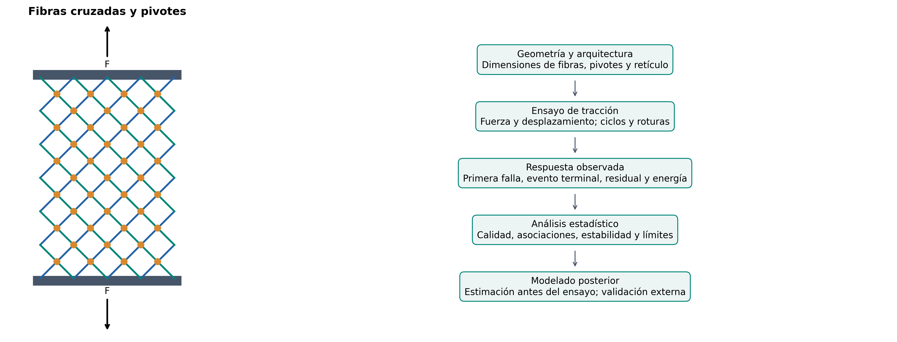
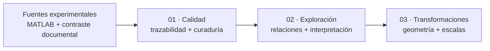

# Caracterización estadístico-mecánica de estructuras pantográficas

**Universidad Nacional de Ingeniería · Facultad de Ingeniería Industrial y de Sistemas**<br>
Maestría en Inteligencia Artificial · Trabajo de Investigación II · MIA, 4.º ciclo, sección B · **2026-2**<br>
**Investigadora:** Melissa Dessire Aylas Barranca · **Docente:** Glen Dario Rodríguez Rafael

> **Título académico:** ANÁLISIS EXPLORATORIO Y CARACTERIZACIÓN ESTADÍSTICO-MECÁNICA DE ESTRUCTURAS PANTOGRÁFICAS: CALIDAD DE DATOS, GEOMETRÍA Y RESPUESTA EXPERIMENTAL.

Se investiga cómo la geometría de fibras y pivotes y la arquitectura de un retículo se relacionan con su respuesta al ensayo de tracción. El objetivo posterior es **predecir la carga de primera falla, en newtons, utilizando únicamente información conocida antes del ensayo**. La rama `eda` reúne el contexto de las variables, la curaduría, el análisis exploratorio y las transformaciones geométricas.

Una estructura pantográfica es una red de dos familias de fibras conectadas por pivotes deformables. Su interés como metamaterial mecánico reside en diseñar la respuesta mediante la arquitectura, además del material constituyente. Estudiar las relaciones geometría–respuesta permite formular hipótesis, detectar redundancias y evitar interpretar una correlación inducida por el diseño como una ley física.

**Documentación y resultados:** [EDA ejecutado en notebook](notebooks/02_EDA_Avanzado.ipynb) · [informe académico](docs/informe_eda.md) · [diccionario](docs/diccionario_datos.md) · [trazabilidad](docs/trazabilidad_datos.md).

## Índice

- [Experimento y objetivo](#experimento-y-objetivo)
- [INPUT, target y OUTPUT](#input-target-y-output)
- [Tres cuadernos para la entrega](#tres-cuadernos-para-la-entrega)
- [Preguntas y análisis](#preguntas-y-análisis)
- [Estudio de valores atípicos](#estudio-de-valores-atípicos)
- [Hallazgos e implicancias](#hallazgos-e-implicancias)
- [Calidad y límites](#calidad-y-límites)
- [Estructura del proyecto](#estructura-del-proyecto)
- [Reproducción](#reproducción)
- [Fuentes y privacidad](#fuentes-y-privacidad)

## Experimento y objetivo

| Aspecto | Definición y alcance |
|---|---|
| Fuente experimental | Archivo MATLAB recibido, contrastado con el capítulo 9 y el apéndice de la tesis doctoral de Enrico Venditti |
| Procedencia académica | Venditti: doctorado en Arquitectura y Ambiente, Università degli Studi di Sassari, Italia; portada 2024/2025. El plan de tesis 2026 registra la provisión académica de datos por Emilio Turco |
| Material y fabricación | Poliamida —nylon— mediante sinterización láser selectiva, según la tesis |
| Arquitectura | Fibras cruzadas y pivotes; familias de discretización del retículo |
| Envolvente nominal | 210 × 70 mm; más celdas no significa mayor longitud exterior |
| Ensayo documentado | Tracción con carga y descarga; velocidad de desplazamiento de 15 mm/min y niveles nominales cada 10 mm |
| Respuesta objetivo | Fuerza asociada al primer evento de rotura identificado de una fibra o un pivote |
| Estado científico | Exploración reproducible del archivo recibido; diferencias geométricas MATLAB–PDF registradas y pendientes de conciliación |

La fuerza mide la acción aplicada; el desplazamiento mide el cambio de posición. Una deformación unitaria requeriría definir una longitud de referencia. Tras la primera rotura pueden quedar elementos conectados que transmitan carga: **primera falla, rotura terminal y máximo global no son equivalentes**.

La [introducción científica](docs/introduccion_experimento.md) explica los mecanismos y las fuentes. La metodología es pertinente para investigación peruana en diseño y fabricación; su transferencia a otro material, proceso o aplicación requiere verificación experimental local.



*Esquema idealizado, sin escala; no reproduce exactamente una probeta ni simula su deformación. Fuente conceptual contrastada en la trazabilidad.*

## INPUT, target y OUTPUT

**INPUT** es una característica disponible antes del ensayo. **OUTPUT** es una respuesta obtenida durante o después. El **target** es el OUTPUT elegido como objetivo predictivo.

| Rol | Variables reales | Unidad | Uso |
|---|---|---|---|
| INPUT · arquitectura | `n_cells_Y`, `Pivot_total_number` | conteos | Celdas en Y y cantidad de pivotes |
| INPUT · fibras | `Fiber_height`, `Fiber_base`, `Fiber_total_length` | mm | Dimensiones y longitud declarada de fibras |
| INPUT · pivotes | `Pivot_height`, `Pivot_radius` | mm | Geometría local de conexiones |
| INPUT · volúmenes | `Fiber_total_volume`, `Pivot_total_volume`, `Sample_total_volume` | mm³ | Volúmenes declarados de componentes y volumen CAD del espécimen |
| **Target** | **`First_Failure_Load_N`** | **N** | **Carga de primera falla: fuerza del primer evento de rotura identificado en la fuente** |
| OUTPUT · evento terminal | `Ultimate_Load` | N | Fuerza asociada a rotura terminal; no máximo global automático |
| OUTPUT · desplazamientos | `Maximum_Displacement`, `residual_Displacement_*` | mm | Respuesta global y residual por ciclo |
| OUTPUT · energías | `Energy_Dissipated`, `Energy_Fracture` | mJ | Resúmenes por ciclo y evento; unidad cotejada en el apéndice |
| Metadato | `Case_n` | identificador | Trazabilidad; excluido de los predictores |

La relación futura de regresión es **F_primera_falla = f(X_geometría, X_estructura) + error**. Su salida será una fuerza estimada en N para una configuración comparable. Energías, cargas posteriores, residuales y cantidades de eventos **no son entradas admisibles** para predecir antes del ensayo.

El [diccionario completo](docs/diccionario_datos.md), también en [CSV](docs/diccionario_datos.csv), documenta definición física, símbolo, unidad, fuente, fórmula, dominio, disponibilidad temporal y fuga. Distingue datos tabulados, cálculos determinísticos y proxies geométricos. El target ausente no se imputa.

## Tres cuadernos para la entrega

| Orden | Notebook | Contenido |
|---:|---|---|
| **01** | [Ingesta, curaduría y calidad](notebooks/01_Ingesta_Curaduria_y_Calidad.ipynb) | Fuentes, concordancia, esquemas, ausencias, duplicados, configuraciones y alertas de calidad |
| **02** | [Análisis estadístico y mecánico](notebooks/02_EDA_Avanzado.ipynb) | Distribuciones, asociaciones, familias, valores atípicos, influencia, geometría, ciclos, fractura e interpretación de resultados |
| **03** | [Transformaciones exploratorias y contexto de las variables](notebooks/03_Transformaciones_Exploratorias.ipynb) | Fórmulas geométricas, representaciones, logaritmos, escalamiento y significado de las variables derivadas |

**Los tres archivos `.ipynb` contienen el código, las figuras, las tablas y sus interpretaciones.**



## Preguntas y análisis

| Eje científico | Análisis y evidencia | Pregunta |
|---|---|---|
| Calidad y procedencia | Concordancia MATLAB–CSV, hashes, tipos, ausencias por configuración, duplicados e incidencias documentales | ¿Qué se midió, qué falta y qué puede compararse? |
| Caracterización | Media, mediana, dispersión, cuantiles, IQR, MAD, CV, asimetría, curtosis, ECDF y extremos | ¿Cómo varían geometría y respuesta? |
| INPUT–INPUT | Pearson/Spearman, identidades, redundancia, VIF y valores singulares | ¿Qué descriptores repiten información? |
| INPUT–OUTPUT | Pearson, Spearman, Kendall, soporte efectivo y omisión de caso | ¿Qué geometrías se asocian con la primera falla y otras respuestas? |
| OUTPUT–OUTPUT | Cargas, desplazamientos, energía y dependencias algebraicas | ¿Qué respuestas describen aspectos distintos del ensayo? |
| Arquitectura y confusión | Variación entre/dentro de familia, contrastes y perfiles | ¿Qué patrones proceden del diseño? |
| Robustez | IQR/MAD, Cook, leverage, bootstrap, permutaciones y FDR BH/BY | ¿Cuánto dependen los hallazgos de casos y supuestos? |
| Multivariado | PCA, escalas/representaciones y diagnóstico de agrupamientos | ¿Cómo se organiza el espacio geométrico? |
| Mecánica experimental | Residuales por ciclo, complemento nominal y energías por evento | ¿Qué describe la evolución observada del daño? |
| Transformaciones | Áreas, razones, segundos momentos ideales, logaritmos y escalamiento | ¿Cómo cambia la representación sin alterar el significado físico? |

Las figuras se exportan en **PNG de 300 dpi o superior y SVG**. Las tablas técnicas conservan los tamaños efectivos. El [informe](docs/informe_eda.md) responde RQ1–RQ12 y conecta resultados, interpretación, límites y recomendaciones experimentales.

## Estudio de valores atípicos

El estudio distingue **un valor extremo, una geometría poco habitual, un caso influyente y una posible inconsistencia física**. Cada diagnóstico responde a una pregunta diferente.

| Análisis | Dónde revisarlo | Interpretación |
|---|---|---|
| IQR y puntuación robusta basada en MAD, globales y por familia | Cuaderno 01, **§1.11**; cuaderno 02, **§2.7** | Identifica valores extremos respetando diferencias de arquitectura; MAD igual a cero se informa como criterio no calculable |
| Distancia de Mahalanobis en el subespacio PCA | Cuaderno 02, **§2.20** | Examina combinaciones geométricas poco habituales, aunque ninguna variable aislada resulte extrema |
| Leverage y distancia de Cook en un ajuste descriptivo | Cuaderno 02, **§2.20** | Evalúa cuánto influye un caso sobre una tendencia concreta; no certifica que ese registro sea erróneo |
| Omisión individual y revisión de incidencias geométricas | Cuaderno 02, **§2.21–2.22**, y tablas de sensibilidad | Comprueba si el signo o la intensidad de las asociaciones dependen de casos particulares |

Por ejemplo, los casos 1 y 3 muestran influencia en el ajuste descriptivo examinado, y la energía del caso 5 en el quinto ciclo requiere revisión pese a coincidir con la fuente documental. **Las banderas se conservan para revisión: no se eliminan ni sustituyen observaciones automáticamente.** La interpretación contrasta la señal estadística con la familia, la definición de la variable y su procedencia.

Resultados: [alertas de calidad](reports/eda_calidad/tables/11_alertas_robustas.csv), [influencia](reports/eda/tables/20_influencia.csv) y [sensibilidad geométrica](reports/eda/tables/22_sensibilidad_geometrica.csv).

## Hallazgos e implicancias

| Evidencia calculada | Interpretación defendible | Implicancia |
|---|---|---|
| El 96,55 % de la variación observada de primera falla corresponde a diferencias entre familias | La arquitectura organiza la distribución; no es precisión predictiva | Separar relaciones globales y dentro de familia |
| Volumen CAD–primera falla: r = 0,773 y ρ = 0,799; asociación condicionada ρ = −0,265 | La tendencia global mezcla familias; el intervalo condicionado incluye cero | No atribuir un efecto causal a incrementar volumen |
| Ninguna asociación condicionada supera FDR BH del 5 % | Los efectos independientes del agrupamiento permanecen inciertos | Formular hipótesis y obtener evidencia adicional |
| Volúmenes declarados de fibras+pivotes suman 6524,01 mm³ | Su anticorrelación responde a una restricción; la suma no es el volumen CAD | Controlar redundancia de entradas |
| Energía del primer evento–primera falla: ρ = 0,988; rango por omisión 0,986–0,992 | Asociación estable entre respuestas del mismo ensayo | Interpretación mecánica; excluir del INPUT previo |
| Mediana residual/amplitud nominal: 0,452 → 0,677 en cohorte común | Aumenta la fracción residual mediana con ciclo/amplitud | No confundir con fatiga ni recuperación independiente |
| Mediana fuerza/pivote: 0,594; 0,589; 0,852 N/pivote para Y = 4/5/6 | La diferencia 4–5 se atenúa con ese denominador | La normalización no mide la fuerza interna de cada unión |
| Representación original: rango numérico 7 entre 9 columnas variables; núcleo propuesto: 5 de 5, con tolerancia relativa 10⁻¹⁰ | Hay redundancia lineal, sin contar redondeo como nueva dimensión | Interpretar la información que aporta cada representación |

La relación volumen–carga también es sensible a la omisión dentro de algunas familias: su signo puede cambiar en Y = 4 y Y = 6. Las discrepancias geométricas con las fichas limitan la atribución mecánica. Evidencia: [cuaderno 02](notebooks/02_EDA_Avanzado.ipynb), [tablas completas](reports/eda_relaciones/tables/) y [síntesis](reports/eda/hallazgos.md).

## Calidad y límites

Un hash correcto acredita integridad del archivo; no demuestra que su geometría coincida con la ficha definitiva. La auditoría distingue ambas comprobaciones.

- **Geometrías discrepantes:** tabla general, fichas y MATLAB difieren en campos identificados. Se documentan valores y páginas sin correcciones automáticas.
- **Carga terminal reportada:** su definición conceptual se verifica en el protocolo, pero hay discordancias numéricas frente a los picos del apéndice. El caso 27 requiere aclaración: `Ultimate_Load` coincide numéricamente con el desplazamiento máximo. Se conserva el valor recibido y se limita su interpretación.
- **Esquema actual e histórico:** `Fiber_base` existe en la fuente y el snapshot anterior, pero no está seleccionada en el esquema actual. El EDA conserva su definición y examina esa diferencia de versiones.
- **Ausencias y dependencia:** ausencia no equivale a cero ni a inexistencia de un evento. Los ciclos del mismo espécimen no se tratan como ensayos independientes; identificadores únicos no prueban independencia.
- **Inferencia exploratoria:** remuestreo y permutaciones dependen de intercambiabilidad. El rango por omisión no es un intervalo de confianza. La separación de clusters es modesta y no define nuevos tipos físicos.
- **Mecánica:** existen curvas como figuras PDF, pero el MATLAB contiene resúmenes. No se reconstruyen curvas, rigidez experimental, esfuerzo, tenacidad ni histéresis a partir de máximos o agregados.
- **Generalización:** nuevas campañas, materiales, procesos o arquitecturas requieren validación. Se necesitan fichas reconciliadas, réplicas identificadas y datos instrumentales.

Documentación: [informe de curaduría](docs/informe_curaduria.md) · [trazabilidad y discrepancias](docs/trazabilidad_datos.md).

## Estructura del proyecto

La estructura separa evidencia, decisiones metodológicas, implementación y resultados. Cada resultado debe poder rastrearse hasta la fuente y las decisiones de análisis.

```text
T02_MIA14_SeccionB/
├── docs/
│   ├── introduccion_experimento.md    # Material, mecanismos y ensayo
│   ├── diccionario_datos.md          # Definiciones, unidades, fórmulas y roles
│   ├── diccionario_datos.csv
│   ├── trazabilidad_datos.md         # Fuentes, páginas y discrepancias
│   ├── informe_curaduria.md          # Evidencia e incidencias de calidad
│   └── informe_eda.md                # Interpretación académica y RQ1–RQ12
├── config/
│   └── data_schema.yml              # Variables, unidades y reglas de curaduría
├── data/
│   ├── raw/dati_campagna_venditti.m   # Fuente experimental original
│   ├── interim/preliminary/          # Extracción verificable
│   ├── processed/preliminary/        # Tabla analítica preliminar
│   └── README.md                    # Procedencia y versiones de datos
├── notebooks/
│   ├── 01_Ingesta_Curaduria_y_Calidad.ipynb
│   ├── 02_EDA_Avanzado.ipynb
│   └── 03_Transformaciones_Exploratorias.ipynb
├── reports/
│   ├── eda_calidad/                  # Auditoría, PNG/SVG, CSV y manifiesto
│   ├── eda_relaciones/               # Asociaciones, soporte y sensibilidad
│   ├── eda_transformaciones/         # Fórmulas, representaciones y escalas
│   ├── verificacion_eda.json         # Comprobación de artefactos y enlaces
│   └── eda/
│       ├── figures/                 # Figuras científicas exportables
│       ├── tables/                  # Resultados exploratorios en CSV
│       ├── hallazgos.md             # Evidencia e interpretación
│       └── manifest.json           # Hashes y parámetros de cálculo
├── src/
│   ├── importar_matlab.py           # Lectura restringida de la fuente
│   ├── ingesta.py                   # Integridad y tabla intermedia
│   ├── preprocesamiento.py          # Curaduría y tabla analítica
│   ├── eda_calidad.py               # Auditoría de calidad y coherencia
│   ├── eda_relaciones.py            # Asociaciones y sensibilidad
│   ├── eda.py                       # Análisis estadístico exploratorio
│   ├── eda_energia.py               # Ciclos y eventos energéticos
│   ├── transformaciones_eda.py       # Geometría derivada y escalas
│   ├── verificar_eda.py             # Outputs, enlaces, hashes y figuras
│   └── reporte_eda.py               # Ejecución reproducible de cuadernos
├── tests/
│   ├── test_importar_matlab.py
│   ├── test_eda.py
│   ├── test_eda_energia.py
│   ├── test_eda_calidad.py
│   ├── test_eda_relaciones.py
│   └── test_transformaciones_eda.py
├── logs/
├── requirements.txt
├── pyproject.toml
└── README.md
```

### Datos

| Ruta | Responsabilidad | Regla |
|---|---|---|
| `data/raw/` | Fuente experimental original | Se conserva sin modificaciones |
| `data/interim/preliminary/` | Tabla extraída, hash y manifiesto | Etapa intermedia visible antes de seleccionar variables |
| `data/processed/preliminary/` | Tabla analítica y reporte de calidad | Versión preliminar para revisión, todavía no definitiva |
| `reports/` | Tablas, figuras y manifiestos del EDA | Evidencia exploratoria organizada por tema y vinculada a los notebooks |
| `logs/` | Eventos, advertencias y fallos | Complementan los manifiestos |

**Interim** significa etapa intermedia: traduce la fuente MATLAB a una tabla verificable antes de aplicar la curaduría. Las ejecuciones fechadas permanecen fuera de Git; las carpetas `preliminary/` conservan copias estables para revisar la evidencia.

La ampliación del conjunto depende de nuevos ensayos o simulaciones físicamente validadas, con una fuente y un protocolo documentados.

### Configuración

| Archivo | Responsabilidad |
|---|---|
| `config/data_schema.yml` | Target, identificadores, predictores, unidades y reglas de curaduría |

### Código científico

| Módulo | Responsabilidad |
|---|---|
| `importar_matlab.py` | Extrae la tabla `samples` sin ejecutar código MATLAB |
| `eda_calidad.py` | Audita concordancia, ausencias, configuraciones e incidencias sin reemplazar snapshots |
| `eda_relaciones.py` | Matrices completas, tamaño efectivo, caracterización y sensibilidad por pareja |
| `transformaciones_eda.py` | Fórmulas geométricas, representaciones y verificación del preprocesamiento |
| `eda.py` | Asociaciones globales/condicionadas, permutaciones, bootstrap, FDR y diagnósticos de influencia |
| `eda_energia.py` | Extrae de forma restringida matrices energéticas para interpretación posensayo |
| `verificar_eda.py` | Verifica ejecución guardada, enlaces, hashes y exportaciones sin recalcular |
| `reporte_eda.py` | Ejecuta los tres cuadernos exploratorios y conserva sus resultados |
| `ingesta.py` | Valida la fuente, calcula SHA-256 y crea la versión intermedia |
| `preprocesamiento.py` | Construye la tabla analítica y registra exclusiones y calidad |

### Notebooks y código

Los cuadernos siguen el orden **calidad → exploración → transformaciones**. Documentan las preguntas, muestran el cálculo y desarrollan la interpretación; la lógica reutilizable permanece en `src/`. Las pruebas en `tests/` comprueban la extracción, los estadísticos y las transformaciones.

## Reproducción

Desde la raíz Git, en la rama `eda`:

```powershell
python -m venv .venv
.\.venv\Scripts\Activate.ps1
python -m pip install -r requirements.txt
python -m src.reporte_eda --execute --all
python -m pytest tests -q
python -m src.verificar_eda
```

El comando ejecuta los cuadernos 01→02→03 desde kernels limpios y guarda outputs. Las nuevas ejecuciones de ingesta/curaduría quedan versionadas; los snapshots históricos `preliminary/` se verifican y conservan. Los manifiestos registran hashes, parámetros y versiones.

`.gitattributes` conserva los bytes de las fuentes y artefactos con SHA-256 para que Git no altere sus huellas al convertir saltos de línea entre plataformas.

Solo análisis 02: `python -m src.reporte_eda --execute`. Los resultados se guardan en el `.ipynb` correspondiente.

Los documentos interpretan esta versión de resultados. Si cambia la fuente, deben revisarse también las cifras y conclusiones del informe y README. Los PDF privados se necesitan para repetir el cotejo documental, pero no para recalcular las tablas y figuras del archivo MATLAB disponible.

## Fuentes y privacidad

- **Venditti, E.** *Analisi strutturale per lo studio del danneggiamento in materiali e strutture complesse*. Tesis doctoral, Università degli Studi di Sassari, año académico 2024/2025 en portada. Capítulo 9 y apéndice; páginas precisas en [trazabilidad](docs/trazabilidad_datos.md).
- **Aylas Barranca, M. D. (2026).** Plan de tesis UNI. Procedencia académica registrada en páginas PDF 24 y 26.
- **Turco y colaboradores (2017, 2019).** Antecedentes Hencky y Piola–Hencky; referencias verificadas y diferencias de protocolo en [introducción](docs/introduccion_experimento.md).
- **Métodos:** [SciPy: Spearman](https://docs.scipy.org/doc/scipy/reference/generated/scipy.stats.spearmanr.html), [control FDR](https://docs.scipy.org/doc/scipy/reference/generated/scipy.stats.false_discovery_control.html) y [scikit-learn: preprocesamiento](https://scikit-learn.org/stable/modules/preprocessing.html).

Se conserva el MATLAB previamente incorporado al proyecto; no se agregan PDF privados. `.gitignore` excluye PDF, referencias privadas y ejecuciones locales. La licencia del código no implica permiso adicional sobre documentos de terceros. Se trabaja en **`eda`**, sin merge ni cambios en `main`.
