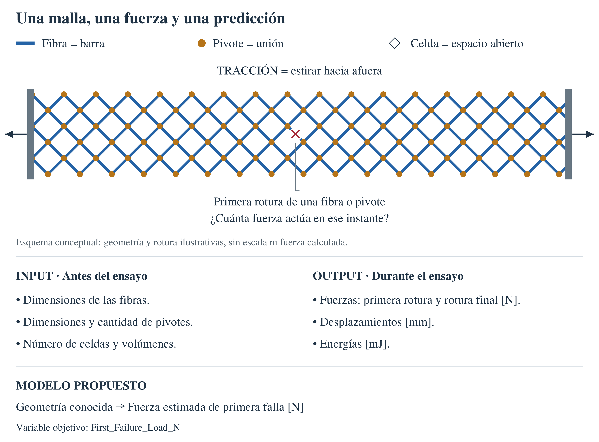
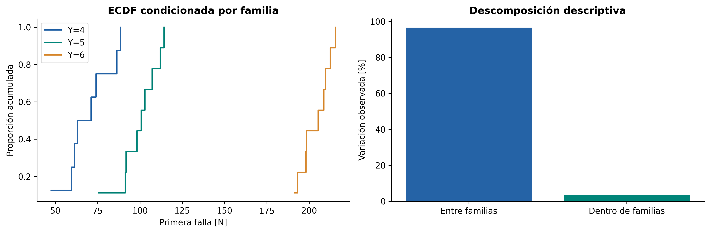
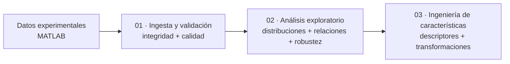

# Análisis exploratorio de datos (EDA) de estructuras pantográficas

**Universidad Nacional de Ingeniería · Facultad de Ingeniería Industrial y de Sistemas**<br>
Maestría en Inteligencia Artificial · Trabajo de Investigación II · MIA, 4.º ciclo, sección B · **2026-2**<br>
**Investigadora:** Melissa Dessire Aylas Barranca · **Docente:** Glen Dario Rodríguez Rafael

Se investiga cómo la geometría de fibras y pivotes y la arquitectura de un retículo se relacionan con su respuesta al ensayo de tracción. El objetivo posterior es **predecir la carga de primera falla, en newtons, utilizando únicamente información conocida antes del ensayo**. La rama `eda` reúne el contexto de las variables, la curaduría, el análisis exploratorio y las transformaciones geométricas.

**Documentación y resultados:** [EDA ejecutado en notebook](notebooks/02_EDA_Avanzado.ipynb) · [informe académico](docs/informe_eda.md) · [diccionario](docs/diccionario_datos.md) · [trazabilidad](docs/trazabilidad_datos.md).

## Índice

- [Experimento y objetivo](#experimento-y-objetivo)
- [INPUT, target y OUTPUT](#input-target-y-output)
- [Gráficos para explicar los datos](#gráficos-para-explicar-los-datos)
- [Tres cuadernos para la entrega](#tres-cuadernos-para-la-entrega)
- [Preguntas y análisis](#preguntas-y-análisis)
- [Estudio de valores atípicos](#estudio-de-valores-atípicos)
- [Hallazgos e implicancias](#hallazgos-e-implicancias)
- [Calidad y límites](#calidad-y-límites)
- [Estructura del proyecto](#estructura-del-proyecto)
- [Reproducción](#reproducción)
- [Fuentes y privacidad](#fuentes-y-privacidad)

## Experimento y objetivo



[Ampliar el esquema en formato vectorial](docs/figures/malla_fuerzas_variables.svg).

| Aspecto | Definición y alcance |
|---|---|
| Fuente experimental | Archivo MATLAB recibido, contrastado con el capítulo 9 y el apéndice de la tesis doctoral de Enrico Venditti |
| Material y fabricación | Poliamida —nylon— mediante sinterización láser selectiva, según la tesis |
| Envolvente nominal | 210 × 70 mm; más celdas no significa mayor longitud exterior |
| Ensayo documentado | Tracción con carga y descarga; velocidad de desplazamiento de 15 mm/min y niveles nominales cada 10 mm |
| Equipo e instrumentos | Equipo de ensayo de tracción, con probetas sujetas y registro de fuerza y desplazamiento. También se documenta grabación del sonido de las roturas. La descripción revisada no identifica marca, modelo ni sensores específicos |
| Estado científico | Exploración reproducible del archivo recibido; diferencias geométricas MATLAB–PDF registradas y pendientes de conciliación |

**Cómo se aplica la carga**

| Término | Explicación en este ensayo |
|---|---|
| **Carga** | Fuerza aplicada, medida en newtons (N). Durante la fase de carga aumenta el desplazamiento impuesto; la fuerza puede caer si ocurre una rotura |
| **Descarga** | Se reduce la solicitación y se observa cuánto recupera su forma la estructura y qué desplazamiento permanece. No implica necesariamente compresión |
| **Desplazamiento** | Cambio de posición, medido en milímetros (mm). Los 15 mm/min describen la velocidad de desplazamiento; no son una fuerza |
| **Flexión y giros internos** | Las fibras pueden doblarse y las conexiones girar durante la tracción. Son mecanismos de deformación; no acreditan ensayos independientes de flexión o torsión |

Tras la primera rotura pueden quedar elementos que transmitan carga: **primera falla, rotura terminal y fuerza máxima del ensayo son conceptos distintos**. Protocolo y registro de sonido: Venditti, páginas 96–97 del PDF; [trazabilidad](docs/trazabilidad_datos.md).

La [introducción científica](docs/introduccion_experimento.md) explica los mecanismos y las fuentes. La metodología es pertinente para investigación peruana en diseño y fabricación; su transferencia a otro material, proceso o aplicación requiere verificación experimental local.

## INPUT, target y OUTPUT

Los nombres exactos de la fuente se relacionan con los componentes y respuestas del esquema. El **target** es el OUTPUT elegido para predecir.

| Rol | Nombre en los datos | Unidad | Significado sencillo | Ejemplo real · caso 1 |
|---|---|---|---|---|
| INPUT · arquitectura | `n_cells_Y`, `Pivot_total_number` | conteos | Celdas en Y y cantidad de pivotes | 4 celdas; 113 pivotes |
| INPUT · fibras | `Fiber_height`, `Fiber_base`, `Fiber_total_length` | mm | Altura y base de la sección de las barras; longitud total de fibras | Altura: 1; base: 2.4; longitud: 2685.82 |
| INPUT · pivotes | `Pivot_height`, `Pivot_radius` | mm | Altura y radio de las pequeñas uniones entre fibras | Altura: 1; radio: 0.5 |
| INPUT · volúmenes | `Fiber_total_volume`, `Pivot_total_volume`, `Sample_total_volume` | mm³ | Volúmenes declarados de componentes y volumen CAD del espécimen | Fibras: 6435.30; pivotes: 88.71; espécimen: 6249.74 |
| **Target** | **`First_Failure_Load_N`** | **N** | **Carga de primera falla: fuerza del primer evento de rotura identificado en la fuente** | **47.55** |
| OUTPUT · evento terminal | `Ultimate_Load` | N | Fuerza asociada a rotura terminal; no máximo global automático | 51.19 |
| OUTPUT · desplazamientos | `Maximum_Displacement`, `residual_Displacement_*` | mm | Mayor desplazamiento alcanzado y desplazamiento que permanece al descargar cada ciclo | Máximo: 72.48; residual del ciclo 1: 5.97 |
| OUTPUT · energías | `Energy_Dissipated`, `Energy_Fracture` | mJ | Energía disipada por ciclo y asociada a eventos de rotura; matrices del MATLAB, analizadas por separado del CSV principal | Disipada, ciclo 1: 0.2247; fractura, evento 1: 812.5974 |
| Metadato | `Case_n` | identificador | Trazabilidad; excluido de los predictores | 1 |

Los ejemplos pertenecen al mismo caso: geometría y respuestas de la [tabla intermedia](data/interim/preliminary/dataset_interim.csv), y energías del [archivo MATLAB](data/raw/dati_campagna_venditti.m). **Son valores registrados, no predicciones del modelo.**

Se plantea un problema de regresión: estimar una fuerza numérica. Las energías, otras cargas y desplazamientos del ensayo se usan para el EDA, pero no como entradas de una predicción previa al ensayo.

La tabla identifica variables candidatas, no una selección final: `Fiber_base` está en la fuente y el EDA, pero no en la lista del esquema actual; `Pivot_radius` es constante en el dominio observado. `Case_n` identifica el caso y no se usa como predictor. El target ausente no se imputa.

El [diccionario de consulta rápida](docs/diccionario_datos.md#consulta-rápida) muestra **nombre exacto, significado, unidad, tipo de dato y rol**. Las fichas detalladas y el [CSV](docs/diccionario_datos.csv) añaden fuente, fórmula, disponibilidad temporal y limitaciones.

## Gráficos para explicar los datos

Estos gráficos ya están calculados en el cuaderno 02. Cada enlace abre la figura completa.

| Gráfico | Variables y ejes | Qué permite observar |
|---|---|---|
| [Distribución de primera falla](reports/eda/figures/02_objetivo.png) | Fuerza de primera falla [N]; frecuencia y proporción acumulada | Dónde se concentran las fuerzas y cuánto varían |
| [Carga por arquitectura](reports/eda/figures/05_familias.png) | Fuerza de primera falla [N] y proporción acumulada; una curva por familia | Diferencias entre configuraciones y variación entre/dentro de familias |
| [Geometría frente a primera falla](reports/eda/figures/08_dispersion.png) | Dimensiones o volúmenes frente a fuerza [N]; color por familia | Asociaciones INPUT–target y patrones que dependen de la arquitectura |
| [Relaciones entre entradas](reports/eda_relaciones/figures/R01_input_input_spearman.png) | Matriz de variables geométricas; color según correlación | Variables que cambian juntas o repiten información |
| [Desplazamiento residual por ciclo](reports/eda/figures/24_ciclos.png) | Amplitud nominal del ciclo [mm] frente a residual [mm] y residual/amplitud | Cuánto desplazamiento permanece después de descargar |
| [Energía disipada](reports/eda/figures/26_disipacion.png) | Ciclo y energía [mJ] | Evolución de otra respuesta del ensayo y valores que requieren revisión |
| [Atípicos e influencia](reports/eda/figures/20_influencia.png) | Distancia geométrica, residuo, leverage y Cook; cada punto es un caso | Configuraciones poco habituales y casos que afectan una tendencia |



*Izquierda: cada curva muestra la proporción de casos cuya primera falla ocurre hasta la fuerza indicada. Derecha: se separa la variación entre familias y dentro de ellas. Es una comparación descriptiva; no mide la precisión de un modelo.*

Una **curva completa de fuerza–desplazamiento**, con carga, descarga y primera rotura señaladas, sería útil para explicar el ensayo. Para incorporarla como gráfico calculado se requieren las series instrumentales: el MATLAB recibido contiene resúmenes y no permite reconstruir esa curva.

## Tres cuadernos para la entrega

| Orden | Notebook | Contenido |
|---:|---|---|
| **01** | [Ingesta y validación de datos](notebooks/01_Ingesta_Curaduria_y_Calidad.ipynb) | Extracción, contrato de datos, integridad, valores faltantes, duplicados y consistencia geométrica |
| **02** | [Análisis exploratorio](notebooks/02_EDA_Avanzado.ipynb) | Análisis univariado, bivariado y multivariado; valores atípicos, influencia, ciclos, eventos e interpretación de resultados |
| **03** | [Ingeniería de características](notebooks/03_Transformaciones_Exploratorias.ipynb) | Descriptores geométricos, redundancia, logaritmos, escalamiento y evaluación exploratoria de las características derivadas |

**Los tres archivos `.ipynb` contienen el código, las figuras, las tablas y sus interpretaciones.**

**Secuencia del análisis:** carga y calidad → univariado → bivariado → multivariado → atípicos e influencia → ciclos y eventos → interpretación. El cuaderno 03 desarrolla la ingeniería de características a partir de esos resultados.

El contexto experimental, las fuentes y el diccionario completo se concentran en [`docs/`](docs/). Los notebooks presentan el método, el código ejecutado y la interpretación de cada análisis.



## Preguntas y análisis

| Eje científico | Análisis y evidencia | Pregunta |
|---|---|---|
| Calidad y procedencia | Concordancia MATLAB–CSV, hashes, tipos, ausencias por configuración, duplicados e incidencias documentales | ¿Qué se midió, qué falta y qué puede compararse? |
| Caracterización | Media, mediana, dispersión, cuantiles, IQR, MAD, CV, asimetría, curtosis, ECDF y extremos | ¿Cómo varían geometría y respuesta? |
| INPUT–INPUT | Pearson/Spearman, identidades, redundancia, VIF y valores singulares | ¿Qué descriptores repiten información? |
| INPUT–OUTPUT | Pearson, Spearman, Kendall, soporte efectivo y omisión de caso | ¿Qué geometrías se asocian con la primera falla y otras respuestas? |
| OUTPUT–OUTPUT | Cargas, desplazamientos, energía y dependencias algebraicas | ¿Qué respuestas describen aspectos distintos del ensayo? |
| Arquitectura y confusión | Variación entre/dentro de familia, contrastes y perfiles | ¿Qué patrones proceden del diseño? |
| Robustez | IQR/MAD, Cook, leverage, bootstrap, permutaciones y FDR BH/BY | ¿Cuánto dependen los hallazgos de casos y supuestos? |
| Multivariado | PCA, escalas/representaciones y diagnóstico de agrupamientos | ¿Cómo se organiza el espacio geométrico? |
| Mecánica experimental | Residuales por ciclo, complemento nominal y energías por evento | ¿Qué describe la evolución observada del daño? |
| Transformaciones | Áreas, razones, segundos momentos ideales, logaritmos y escalamiento | ¿Cómo cambia la representación sin alterar el significado físico? |

Las figuras se exportan en **PNG de 300 dpi o superior y SVG**. Las tablas técnicas conservan los tamaños efectivos. El [informe](docs/informe_eda.md) responde RQ1–RQ12 y conecta resultados, interpretación, límites y recomendaciones experimentales.

## Estudio de valores atípicos

El estudio distingue **un valor extremo, una geometría poco habitual, un caso influyente y una posible inconsistencia física**. Cada diagnóstico responde a una pregunta diferente.

| Análisis | Dónde revisarlo | Interpretación |
|---|---|---|
| IQR y puntuación robusta basada en MAD, globales y por familia | Cuaderno 01, **§1.11**; cuaderno 02, **§2.2.4** | Identifica valores extremos respetando diferencias de arquitectura; MAD igual a cero se informa como criterio no calculable |
| Distancia de Mahalanobis en el subespacio PCA | Cuaderno 02, **§2.5.1** | Examina combinaciones geométricas poco habituales, aunque ninguna variable aislada resulte extrema |
| Leverage y distancia de Cook en un ajuste descriptivo | Cuaderno 02, **§2.5.1** | Evalúa cuánto influye un caso sobre una tendencia concreta; no certifica que ese registro sea erróneo |
| Omisión individual y revisión de incidencias geométricas | Cuaderno 02, **§2.5.3–2.5.4**, y tablas de sensibilidad | Comprueba si el signo o la intensidad de las asociaciones dependen de casos particulares |

Por ejemplo, los casos 1 y 3 muestran influencia en el ajuste descriptivo examinado, y la energía del caso 5 en el quinto ciclo requiere revisión pese a coincidir con la fuente documental. **Las banderas se conservan para revisión: no se eliminan ni sustituyen observaciones automáticamente.** La interpretación contrasta la señal estadística con la familia, la definición de la variable y su procedencia.

Resultados: [alertas de calidad](reports/eda_calidad/tables/11_alertas_robustas.csv), [influencia](reports/eda/tables/20_influencia.csv) y [sensibilidad geométrica](reports/eda/tables/22_sensibilidad_geometrica.csv).

## Hallazgos e implicancias

| Evidencia calculada | Interpretación defendible | Implicancia |
|---|---|---|
| El 96,55 % de la variación observada de primera falla corresponde a diferencias entre familias | La arquitectura organiza la distribución; no es precisión predictiva | Separar relaciones globales y dentro de familia |
| Volumen CAD–primera falla: r = 0,773 y ρ = 0,799; asociación condicionada ρ = −0,265 | La tendencia global mezcla familias; el intervalo condicionado incluye cero | No atribuir un efecto causal a incrementar volumen |
| Ninguna asociación condicionada supera FDR BH del 5 % | Los efectos independientes del agrupamiento permanecen inciertos | Formular hipótesis y obtener evidencia adicional |
| Volúmenes declarados de fibras+pivotes suman 6524,01 mm³ | Su anticorrelación responde a una restricción; la suma no es el volumen CAD | Controlar redundancia de entradas |
| Energía del primer evento–primera falla: ρ = 0,988; rango por omisión 0,986–0,992 | Asociación estable entre respuestas del mismo ensayo | Interpretación mecánica; excluir del INPUT previo |
| Mediana residual/amplitud nominal: 0,452 → 0,677 en cohorte común | Aumenta la fracción residual mediana con ciclo/amplitud | No confundir con fatiga ni recuperación independiente |
| Mediana fuerza/pivote: 0,594; 0,589; 0,852 N/pivote para Y = 4/5/6 | La diferencia 4–5 se atenúa con ese denominador | La normalización no mide la fuerza interna de cada unión |
| Representación original: rango numérico 7 entre 9 columnas variables; núcleo propuesto: 5 de 5, con tolerancia relativa 10⁻¹⁰ | Hay redundancia lineal, sin contar redondeo como nueva dimensión | Interpretar la información que aporta cada representación |

La relación volumen–carga también es sensible a la omisión dentro de algunas familias: su signo puede cambiar en Y = 4 y Y = 6. Las discrepancias geométricas con las fichas limitan la atribución mecánica. Evidencia: [cuaderno 02](notebooks/02_EDA_Avanzado.ipynb), [tablas completas](reports/eda_relaciones/tables/) y [síntesis](reports/eda/hallazgos.md).

## Calidad y límites

Un hash correcto acredita integridad del archivo; no demuestra que su geometría coincida con la ficha definitiva. La auditoría distingue ambas comprobaciones.

- **Geometrías discrepantes:** tabla general, fichas y MATLAB difieren en campos identificados. Se documentan valores y páginas sin correcciones automáticas.
- **Carga terminal reportada:** su definición conceptual se verifica en el protocolo, pero hay discordancias numéricas frente a los picos del apéndice. El caso 27 requiere aclaración: `Ultimate_Load` coincide numéricamente con el desplazamiento máximo. Se conserva el valor recibido y se limita su interpretación.
- **Esquema actual e histórico:** `Fiber_base` existe en la fuente y el snapshot anterior, pero no está seleccionada en el esquema actual. El EDA conserva su definición y examina esa diferencia de versiones.
- **Ausencias y dependencia:** ausencia no equivale a cero ni a inexistencia de un evento. Los ciclos del mismo espécimen no se tratan como ensayos independientes; identificadores únicos no prueban independencia.
- **Inferencia exploratoria:** remuestreo y permutaciones dependen de intercambiabilidad. El rango por omisión no es un intervalo de confianza. La separación de clusters es modesta y no define nuevos tipos físicos.
- **Mecánica:** existen curvas como figuras PDF, pero el MATLAB contiene resúmenes. No se reconstruyen curvas, rigidez experimental, esfuerzo, tenacidad ni histéresis a partir de máximos o agregados.
- **Generalización:** nuevas campañas, materiales, procesos o arquitecturas requieren validación. Se necesitan fichas reconciliadas, réplicas identificadas y datos instrumentales.

Documentación: [informe de curaduría](docs/informe_curaduria.md) · [trazabilidad y discrepancias](docs/trazabilidad_datos.md).

## Estructura del proyecto

La estructura separa evidencia, decisiones metodológicas, implementación y resultados. Cada resultado debe poder rastrearse hasta la fuente y las decisiones de análisis.

```text
T02_MIA14_SeccionB/
├── docs/
│   ├── introduccion_experimento.md    # Material, mecanismos y ensayo
│   ├── diccionario_datos.md          # Definiciones, unidades, fórmulas y roles
│   ├── diccionario_datos.csv
│   ├── figures/                     # Esquema del ensayo, INPUT y OUTPUT (PNG y SVG)
│   ├── trazabilidad_datos.md         # Fuentes, páginas y discrepancias
│   ├── informe_curaduria.md          # Evidencia e incidencias de calidad
│   └── informe_eda.md                # Interpretación académica y RQ1–RQ12
├── config/
│   └── data_schema.yml              # Variables, unidades y reglas de curaduría
├── data/
│   ├── raw/dati_campagna_venditti.m   # Fuente experimental original
│   ├── interim/preliminary/          # Extracción verificable
│   ├── processed/preliminary/        # Tabla analítica preliminar
│   └── README.md                    # Procedencia y versiones de datos
├── notebooks/
│   ├── 01_Ingesta_Curaduria_y_Calidad.ipynb
│   ├── 02_EDA_Avanzado.ipynb
│   └── 03_Transformaciones_Exploratorias.ipynb
├── reports/
│   ├── eda_calidad/                  # Auditoría, PNG/SVG, CSV y manifiesto
│   ├── eda_relaciones/               # Asociaciones, soporte y sensibilidad
│   ├── eda_transformaciones/         # Fórmulas, representaciones y escalas
│   ├── verificacion_eda.json         # Comprobación de artefactos y enlaces
│   └── eda/
│       ├── figures/                 # Figuras científicas exportables
│       ├── tables/                  # Resultados exploratorios en CSV
│       ├── hallazgos.md             # Evidencia e interpretación
│       └── manifest.json           # Hashes y parámetros de cálculo
├── src/
│   ├── importar_matlab.py           # Lectura restringida de la fuente
│   ├── ingesta.py                   # Integridad y tabla intermedia
│   ├── preprocesamiento.py          # Curaduría y tabla analítica
│   ├── eda_calidad.py               # Auditoría de calidad y coherencia
│   ├── eda_relaciones.py            # Asociaciones y sensibilidad
│   ├── eda.py                       # Análisis estadístico exploratorio
│   ├── eda_energia.py               # Ciclos y eventos energéticos
│   ├── transformaciones_eda.py       # Geometría derivada y escalas
│   ├── verificar_eda.py             # Outputs, enlaces, hashes y figuras
│   └── reporte_eda.py               # Ejecución reproducible de cuadernos
├── tests/
│   ├── test_importar_matlab.py
│   ├── test_eda.py
│   ├── test_eda_energia.py
│   ├── test_eda_calidad.py
│   ├── test_eda_relaciones.py
│   └── test_transformaciones_eda.py
├── logs/
├── requirements.txt
├── pyproject.toml
└── README.md
```

### Datos

| Ruta | Responsabilidad | Regla |
|---|---|---|
| `data/raw/` | Fuente experimental original | Se conserva sin modificaciones |
| `data/interim/preliminary/` | Tabla extraída, hash y manifiesto | Etapa intermedia visible antes de seleccionar variables |
| `data/processed/preliminary/` | Tabla analítica y reporte de calidad | Versión preliminar para revisión, todavía no definitiva |
| `reports/` | Tablas, figuras y manifiestos del EDA | Evidencia exploratoria organizada por tema y vinculada a los notebooks |
| `logs/` | Eventos, advertencias y fallos | Complementan los manifiestos |

**Interim** significa etapa intermedia: traduce la fuente MATLAB a una tabla verificable antes de aplicar la curaduría. Las ejecuciones fechadas permanecen fuera de Git; las carpetas `preliminary/` conservan copias estables para revisar la evidencia.

La ampliación del conjunto depende de nuevos ensayos o simulaciones físicamente validadas, con una fuente y un protocolo documentados.

### Configuración

| Archivo | Responsabilidad |
|---|---|
| `config/data_schema.yml` | Target, identificadores, predictores, unidades y reglas de curaduría |

### Código científico

| Módulo | Responsabilidad |
|---|---|
| `importar_matlab.py` | Extrae la tabla `samples` sin ejecutar código MATLAB |
| `eda_calidad.py` | Audita concordancia, ausencias, configuraciones e incidencias sin reemplazar snapshots |
| `eda_relaciones.py` | Matrices completas, tamaño efectivo, caracterización y sensibilidad por pareja |
| `transformaciones_eda.py` | Fórmulas geométricas, representaciones y verificación del preprocesamiento |
| `eda.py` | Asociaciones globales/condicionadas, permutaciones, bootstrap, FDR y diagnósticos de influencia |
| `eda_energia.py` | Extrae de forma restringida matrices energéticas para interpretación posensayo |
| `verificar_eda.py` | Verifica ejecución guardada, enlaces, hashes y exportaciones sin recalcular |
| `reporte_eda.py` | Ejecuta los tres cuadernos exploratorios y conserva sus resultados |
| `ingesta.py` | Valida la fuente, calcula SHA-256 y crea la versión intermedia |
| `preprocesamiento.py` | Construye la tabla analítica y registra exclusiones y calidad |

### Notebooks y código

Los cuadernos siguen el orden **ingesta y validación → análisis exploratorio → ingeniería de características**. Cada sección reúne método, cálculo y resultados; la interpretación se apoya en sus tablas y figuras. La lógica reutilizable permanece en `src/`, y las pruebas en `tests/` comprueban la extracción, los estadísticos y las transformaciones.

## Reproducción

Desde la raíz Git, en la rama `eda`:

```powershell
python -m venv .venv
.\.venv\Scripts\Activate.ps1
python -m pip install -r requirements.txt
python -m src.reporte_eda --execute --all
python -m pytest tests -q
python -m src.verificar_eda
```

El comando ejecuta los cuadernos 01→02→03 desde kernels limpios y guarda outputs. Las nuevas ejecuciones de ingesta/curaduría quedan versionadas; los snapshots históricos `preliminary/` se verifican y conservan. Los manifiestos registran hashes, parámetros y versiones.

`.gitattributes` conserva los bytes de las fuentes y artefactos con SHA-256 para que Git no altere sus huellas al convertir saltos de línea entre plataformas.

Solo análisis 02: `python -m src.reporte_eda --execute`. Los resultados se guardan en el `.ipynb` correspondiente.

Los documentos interpretan esta versión de resultados. Si cambia la fuente, deben revisarse también las cifras y conclusiones del informe y README. Los PDF privados se necesitan para repetir el cotejo documental, pero no para recalcular las tablas y figuras del archivo MATLAB disponible.

## Fuentes y privacidad

- **Venditti, E.** *Analisi strutturale per lo studio del danneggiamento in materiali e strutture complesse*. Tesis doctoral, Università degli Studi di Sassari, año académico 2024/2025 en portada. Capítulo 9 y apéndice; páginas precisas en [trazabilidad](docs/trazabilidad_datos.md).
- **Aylas Barranca, M. D. (2026).** Plan de tesis UNI. Procedencia académica registrada en páginas PDF 24 y 26.
- **Turco y colaboradores (2017, 2019).** Antecedentes Hencky y Piola–Hencky; referencias verificadas y diferencias de protocolo en [introducción](docs/introduccion_experimento.md).
- **Métodos:** [SciPy: Spearman](https://docs.scipy.org/doc/scipy/reference/generated/scipy.stats.spearmanr.html), [control FDR](https://docs.scipy.org/doc/scipy/reference/generated/scipy.stats.false_discovery_control.html) y [scikit-learn: preprocesamiento](https://scikit-learn.org/stable/modules/preprocessing.html).

Se conserva el MATLAB previamente incorporado al proyecto; no se agregan PDF privados. `.gitignore` excluye PDF, referencias privadas y ejecuciones locales. La licencia del código no implica permiso adicional sobre documentos de terceros. Se trabaja en **`eda`**, sin merge ni cambios en `main`.
