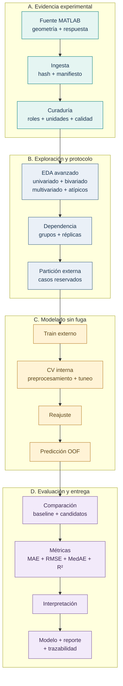
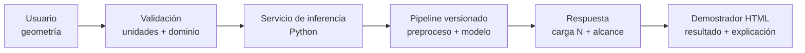

# Predicción de la primera falla en estructuras pantográficas

<div align="center">
  <strong>PIPELINE REPRODUCIBLE</strong> · <strong>EDA EJECUTADO</strong> · <strong>6 MODELOS EVALUADOS</strong> · <strong>DEMOSTRADOR HTML</strong>
</div>

<p align="center">
  <a href="demo/index.html"><strong>Abrir demostrador</strong></a> ·
  <a href="notebooks/01_Ingesta_Curaduria_y_Calidad.ipynb">Ver ingesta y calidad</a> ·
  <a href="notebooks/02_EDA_Avanzado.ipynb">Ver EDA integral</a> ·
  <a href="reports/02_EDA_Avanzado.html">Abrir reporte EDA</a> ·
  <a href="reports/06_Evaluacion_Final_e_Interpretabilidad.html"><strong>Ver resultados de modelos</strong></a> ·
  <a href="data/README.md">Ver datos</a>
</p>

Este proyecto estima la **fuerza de primera falla** de una estructura pantográfica a partir de su geometría. La salida es una fuerza en newtons y el problema se aborda mediante regresión supervisada con validación fuera de muestra.

> **Producto de tesis:** modelo predictivo versionado, pipeline científico reproducible y demostrador interactivo para explorar configuraciones geométricas.

**Autora:** Melissa Dessire Aylas Barranca<br>
Maestría en Ciencias con mención en Inteligencia Artificial — Universidad Nacional de Ingeniería (UNI)

## Resumen ejecutivo

| Entrada | Proceso | Salida científica | Artefacto aplicado |
|---|---|---|---|
| Geometría del espécimen | Curaduría, EDA, validación anidada y comparación de modelos | Estimación de carga de primera falla, métricas e interpretación | Demostrador de predicción estructural |

**Pregunta de investigación:** ¿en qué medida las características geométricas y estructurales permiten estimar la carga de primera falla con precisión fuera de muestra e interpretación mecánicamente coherente?

**Objetivo general:** desarrollar y evaluar un modelo supervisado que estime la carga de primera falla y pueda integrarse en una herramienta interactiva de consulta.

## Ficha técnica

| Elemento | Especificación |
|---|---|
| Objeto de estudio | Red de fibras conectadas mediante pivotes, fabricada en poliamida por sinterización láser selectiva |
| Ensayo | Tracción con registro de fuerza y desplazamiento |
| Input | Geometría y estructura conocidas antes del ensayo |
| Target | `First_Failure_Load_N`: carga de primera falla en N |
| Output | Carga estimada de primera falla para un espécimen comparable |
| Problema de ML | Regresión supervisada |
| Modelos principales | Ridge, Elastic Net, SVR-RBF, árbol, bosque aleatorio y proceso gaussiano |
| Referencia | Baseline que predice un valor central del entrenamiento |
| Métrica principal | MAE fuera de muestra, expresado en N |
| Validación | Validación cruzada anidada; tuneo interno y evaluación externa |
| Estado | Ingesta, curaduría, EDA y comparación de seis modelos ejecutados; pipeline reajustado disponible para inferencia preliminar |

### Alcance

- **Incluye:** estructuras pantográficas comparables, poliamida fabricada por SLS, ensayo de tracción, geometría previa al ensayo y predicción de primera falla.
- **No incluye:** simulación por elementos finitos, predicción de toda la curva fuerza-desplazamiento, fatiga, impacto, compresión ni extrapolación automática a otros materiales.
- **Generalización prevista:** nuevas configuraciones dentro del dominio geométrico y experimental que finalmente sea validado.

## Input, target y output

### Input

Cada fila representa un caso experimental. Solo se consideran variables disponibles antes del ensayo.

| Grupo | Variables | Unidad |
|---|---|---|
| Configuración | `n_cells_Y` | conteo |
| Fibra | `Fiber_height`, `Fiber_base`, `Fiber_total_length` | mm |
| Volumen de fibra | `Fiber_total_volume` | mm³ |
| Pivote | `Pivot_height`, `Pivot_radius`, `Pivot_total_number` | mm / conteo |
| Volumen de pivotes | `Pivot_total_volume` | mm³ |
| Espécimen | `Sample_total_volume` | mm³ |

`Case_n` se conserva únicamente para trazabilidad. `Pivot_radius` es constante en la versión analizada; el pipeline elimina constantes dentro de cada fold.

No se usan como predictores `Ultimate_Load`, desplazamientos residuales, desplazamiento máximo ni energías. Son respuestas obtenidas durante o después del ensayo y producirían fuga de información.

### Target

| Aspecto | Definición |
|---|---|
| Nombre | **Carga de primera falla** |
| Columna | `First_Failure_Load_N` |
| Significado | Fuerza registrada en el primer evento localizado de daño o rotura durante el ensayo de tracción |
| Tipo | Variable numérica continua |
| Unidad | Newton (N) |
| Faltantes | Un target ausente se excluye y se registra; nunca se imputa |
| Diferencia esencial | No es carga última, desplazamiento, energía, esfuerzo ni una clase “falla/no falla” |

La definición experimental exacta del primer evento debe verificarse contra la documentación de la campaña antes de cerrar la tesis.

### Output

El modelo devuelve una estimación de `First_Failure_Load_N` en newtons. Cada ejecución completa también debe producir:

| Salida | Contenido |
|---|---|
| Predicciones OOF | Observado, predicho, residuo, modelo y fold por caso |
| Métricas | MAE, RMSE, MedAE y R² por fold y agregadas |
| Comparación | Diferencia de MAE respecto del baseline de mediana |
| Modelo | Pipeline ajustado, parámetros seleccionados y versión de datos |
| Interpretación | Coeficientes o importancia por permutación según el estimador |
| Trazabilidad | Configuración, índices de partición, hashes, logs y manifiesto |
| Demostrador | Interfaz para ingresar una geometría y consultar predicción, alcance y trazabilidad |

### Variables de estudio

| Rol metodológico | Variables | Uso |
|---|---|---|
| Dependiente | Carga de primera falla | Respuesta que se desea predecir |
| Independientes | Geometría de fibras, pivotes, celdas y volúmenes | Entradas conocidas antes del ensayo |
| Identificación | Número de caso | Trazabilidad; nunca entra al modelo |
| Contexto experimental | Material, fabricación SLS y ensayo de tracción | Define el dominio de aplicación |
| Control de dependencia | Configuración, réplica o familia, si la fuente las confirma | Evita separar casos relacionados entre train y evaluación |
| Respuestas secundarias | Carga última, desplazamientos y energías | Análisis complementario; excluidas del modelo principal |

## Modelos

Los seis candidatos ya se compararon en las mismas particiones de una corrida preliminar. El preprocesamiento y el tuneo se ajustan exclusivamente con entrenamiento.

| Rol | Modelo | Propósito |
|---:|---|---|
| Referencia | Baseline de valor central | Verificar que el aprendizaje automático supere una regla elemental |
| 1 | Ridge | Modelo lineal regularizado, estable ante colinealidad |
| 2 | Elastic Net | Regularización y reducción del efecto de variables redundantes |
| 3 | SVR con kernel RBF | Relación no lineal suave con control de complejidad |
| 4 | Árbol de regresión | Reglas e interacciones no lineales interpretables |
| 5 | Bosque aleatorio | Promedio de árboles para reducir inestabilidad |
| 6 | Proceso gaussiano RBF | Relación no lineal apropiada para datos experimentales limitados |

El **baseline** no compite como solución final. Predice para cada caso el valor típico aprendido solo en el entrenamiento. Se usa la mediana porque cambia menos ante cargas extremas: si un modelo no reduce su error, no aporta evidencia de aprendizaje útil.

Como línea de ampliación se consideran modelos de **deep learning tabular**: MLP, TabNet y FT-Transformer. La MLP ya dispone de un constructor experimental; TabNet y FT-Transformer son propuestas futuras. Solo se activarán si la ampliación del dataset y la validación justifican su complejidad. No se presupone un modelo ganador.

## Métricas

Las métricas se calculan con predicciones fuera de muestra. Sea \(y_i\) la fuerza real y \(\hat{y}_i\) la predicción.

| Métrica | Cálculo | Unidad | Interpretación |
|---|---|---|---|
| **MAE** | \(\frac{1}{n}\sum |y_i-\hat{y}_i|\) | N | Error medio directamente interpretable; **criterio principal de selección** |
| **RMSE** | \(\sqrt{\frac{1}{n}\sum(y_i-\hat{y}_i)^2}\) | N | Penaliza con mayor intensidad los errores grandes |
| **MedAE** | \(\operatorname{mediana}(|y_i-\hat{y}_i|)\) | N | Error típico, menos sensible a observaciones extremas |
| **R² OOF** | \(1-\frac{\sum(y_i-\hat{y}_i)^2}{\sum(y_i-\bar y)^2}\) | Sin unidad | 1 es perfecto; 0 equivale a la referencia de la media; puede ser negativo |
| **Mejora sobre baseline** | \(MAE_{baseline}-MAE_{modelo}\) | N | Un valor positivo indica reducción del error respecto de la mediana |

El MAE selecciona hiperparámetros en la validación interna. La evaluación externa informa todas las métricas, su variación entre folds y los residuos. Accuracy, precision, recall y F1 no corresponden porque el target es continuo.

### Resultados preliminares ejecutados

| Procedimiento | MAE [N] | RMSE [N] | MedAE [N] | R² OOF |
|---|---:|---:|---:|---:|
| Baseline de mediana | 51,56 | 66,80 | 38,77 | −0,293 |
| **Selección de modelo mediante CV interna** | **9,67** | **12,98** | **7,05** | **0,951** |

La segunda fila evalúa el procedimiento completo `selected`, que puede elegir una familia distinta en cada fold. La [comparación por familia](reports/metricas_modelos_preliminares.csv) y el [reporte de evaluación](reports/06_Evaluacion_Final_e_Interpretabilidad.html) incluyen los seis candidatos, residuos e interpretación. El pipeline reajustado con todos los datos pertenece a la familia árbol de regresión; ese reajuste no cuenta con una evaluación independiente adicional.

El alcance es preliminar: casos comparables de la misma campaña, bajo independencia provisional. El EDA previo y las dependencias geométricas requieren una evaluación posterior con datos nuevos o grupos confirmados.

## Flujo reproducible



El fold externo simula casos no vistos. Dentro de su entrenamiento, la validación interna ajusta preprocesamiento, modelo e hiperparámetros. El fold externo se usa una sola vez para medir generalización.

## Protocolo de evaluación

La evaluación separa selección y medición para evitar resultados optimistas:

1. Se reserva un fold externo que representa casos no vistos.
2. Solo con el entrenamiento externo se ajustan imputación, eliminación de constantes y escalamiento.
3. La validación interna compara modelos y realiza el tuneo.
4. El procedimiento seleccionado se reajusta con todo el entrenamiento externo.
5. Se predice una sola vez el fold externo.
6. Las predicciones OOF se reúnen para calcular métricas y residuos.

**Configuración ejecutada:** KFold barajado, 5 folds externos, 3 internos y semilla reproducible. La fuente no declara lotes o réplicas; se asume independencia entre registros para esta corrida exploratoria. Si se confirman grupos dependientes, se repetirá con partición agrupada. El campo `reviewed` registra revisión técnica de viabilidad, no aprobación académica ni independencia demostrada.

| Riesgo | Control aplicado |
|---|---|
| Fuga por variables posensayo | Carga última, desplazamientos y energías quedan fuera del input |
| Fuga por preprocesamiento | Cada transformación se ajusta dentro del fold de entrenamiento |
| Optimismo por tuneo | Selección interna y evaluación externa permanecen separadas |
| Dependencia entre casos | Réplicas o familias confirmadas se mantienen en el mismo grupo |
| Sobreajuste | Regularización, baseline, modelos de complejidad distinta y resultados por fold |
| Interpretación incorrecta | Importancia predictiva se contrasta con mecanismos físicos y no se declara causalidad |

## Etapas ejecutadas

| Etapa | Evidencia visible | Estado |
|---:|---|---|
| 1. Ingesta, curaduría y calidad | [Notebook](notebooks/01_Ingesta_Curaduria_y_Calidad.ipynb) · [Reporte HTML](reports/01_Ingesta_Curaduria_y_Calidad.html) | Ejecutado; verifica hash, esquema, tipos, faltantes, duplicados, constantes, exclusiones y salidas |
| 2. EDA integral | [Notebook](notebooks/02_EDA_Avanzado.ipynb) · [Reporte HTML](reports/02_EDA_Avanzado.html) | Ejecutado; distribuciones, familias, asociaciones condicionadas, interacciones, atípicos, robustez, geometría, ciclos y energías |
| 3. Particiones y preprocesamiento | [Notebook](notebooks/03_Diseno_de_Particiones_y_Preprocesamiento.ipynb) · [Reporte HTML](reports/03_Diseno_de_Particiones_y_Preprocesamiento.html) | Ejecutado; verifica aislamiento de train, validación interna y evaluación externa |
| 4. Baseline | [Notebook](notebooks/04_Baseline_de_Referencia.ipynb) · [Reporte HTML](reports/04_Baseline_de_Referencia.html) | Ejecutado; mediana aprendida en cada entrenamiento y métricas externas |
| 5. Entrenamiento y ajuste | [Notebook](notebooks/05_Entrenamiento_Ajuste_y_Validacion.ipynb) · [Reporte HTML](reports/05_Entrenamiento_Ajuste_y_Validacion.html) | Seis familias entrenadas; tuneo interno, predicciones externas y pipeline reajustado |
| 6. Evaluación e interpretabilidad | [Notebook](notebooks/06_Evaluacion_Final_e_Interpretabilidad.ipynb) · [Reporte HTML](reports/06_Evaluacion_Final_e_Interpretabilidad.html) | Métricas, residuos, estabilidad por fold, permutación e inferencia de comprobación |

La fuente cruda está en [data/raw](data/raw/), la extracción revisable en [data/interim/preliminary](data/interim/preliminary/) y la tabla analítica en [data/processed/preliminary](data/processed/preliminary/). La explicación de cada nivel está en [data/README.md](data/README.md).

El lector MATLAB está implementado y probado con el archivo recibido: extrae `samples` sin ejecutar el script original.

## EDA integral

El [notebook ejecutado](notebooks/02_EDA_Avanzado.ipynb) y su [reporte HTML](reports/02_EDA_Avanzado.html) desarrollan la exploración de geometría, arquitectura y respuestas mecánicas con una interpretación por apartado. La [síntesis de hallazgos](reports/eda/hallazgos.md) reúne evidencia, límites y decisiones.

| Eje | Análisis realizados | Pregunta que resuelve |
|---|---|---|
| Distribución y diseño | Cuantiles, asimetría, ECDF, Q–Q, distribuciones geométricas y mapas de combinaciones | ¿Cómo varía la respuesta y dónde hay soporte experimental? |
| Familias estructurales | Descomposición de variación, contrastes de medianas, delta de Cliff y perfiles de interacción | ¿Qué diferencias corresponden a la arquitectura y cuáles aparecen dentro de familia? |
| Asociación y estabilidad | Pearson, Spearman, Kendall, correlación de distancias, permutaciones, bootstrap y ajustes BH/BY | ¿Qué relaciones persisten al controlar la familia y las comparaciones múltiples? |
| Geometría y coherencia | Identidades de volumen, idealizaciones de fibras/pivotes y descriptores derivados | ¿Qué magnitudes son redundantes y qué definiciones requieren revisión? |
| Multivariado | VIF, espectro singular, PCA, sensibilidad de representación, clusters y vecinos geométricos | ¿Cómo está organizado el espacio de diseño? |
| Atípicos e influencia | IQR/MAD global y por familia, Mahalanobis, Cook, leverage y omisión de cada caso | ¿Qué observaciones influyen en las conclusiones? |
| Respuestas posensayo | Carga posterior, desplazamientos residuales, energías por ciclo y evento | ¿Qué información describe la evolución del daño sin filtrarse al predictor previo? |

**Hallazgos principales:** el volumen del espécimen pasa de una asociación global positiva con la primera falla (ρ = 0,799) a una asociación condicionada negativa (ρ = −0,265). Esta inversión es descriptiva: su intervalo condicionado incluye cero y ninguna asociación condicionada supera FDR BH del 5 %. La suma de los volúmenes declarados de fibras y pivotes es constante en 6524,01 mm³; su correlación inversa responde a una restricción observada en la geometría. La energía del primer evento presenta asociación elevada con la fuerza de primera falla, pero se mide durante el ensayo y queda excluida de los predictores previos.

La calidad formal permanece en el cuaderno 01. Las nuevas incidencias físicas se registran para contrastar con la fuente, sin corregir o eliminar automáticamente observaciones. Las relaciones exploratorias no equivalen a causalidad ni a desempeño predictivo.

## Propuesta de artefacto

El entregable aplicado se denomina **Demostrador de predicción estructural**. La [versión HTML preliminar](demo/index.html) ya permite ingresar una geometría, revisar el dominio experimental y consultar los datos y notebooks. Cuando el modelo quede validado, la interfaz entregará:

- carga de primera falla estimada en N;
- modelo y versión de datos utilizados;
- comparación con el valor central de referencia;
- explicación de las variables más influyentes;
- advertencia cuando la geometría esté fuera del dominio estudiado.

El demostrador presentará resultados del modelo ya validado; no realizará entrenamiento ni sustituirá un ensayo físico.



| Componente | Estado | Responsabilidad |
|---|---|---|
| Interfaz HTML | Preliminar disponible | Captura geometría, valida dominio y presenta el flujo |
| Pipeline Python | Implementado | Preprocesamiento, modelos, evaluación y serialización |
| Pipeline reajustado | Disponible localmente; evaluación preliminar completada | Inferencia de primera falla; la demo aún requiere conexión con este artefacto |
| Servicio de inferencia | Propuesto | Conectar el pipeline versionado con la interfaz |
| Interpretación | Ejecutada por fold | Coeficientes cuando existen e importancia por permutación del modelo seleccionado |

## Estructura del proyecto

La estructura separa evidencia, decisiones metodológicas, implementación y resultados. Esta separación permite rastrear cada predicción hasta su fuente.

```text
T02_MIA14_SeccionB/
├── config/
│   ├── data_schema.yml
│   └── model_config.yml
├── data/
│   ├── raw/dati_campagna_venditti.m
│   ├── interim/preliminary/
│   ├── processed/preliminary/
│   └── README.md
├── demo/
│   └── index.html
├── notebooks/
│   ├── 01_Ingesta_Curaduria_y_Calidad.ipynb
│   ├── 02_EDA_Avanzado.ipynb
│   ├── 03_Diseno_de_Particiones_y_Preprocesamiento.ipynb
│   ├── 04_Baseline_de_Referencia.ipynb
│   ├── 05_Entrenamiento_Ajuste_y_Validacion.ipynb
│   └── 06_Evaluacion_Final_e_Interpretabilidad.ipynb
├── reports/
│   ├── 01_Ingesta_Curaduria_y_Calidad.html
│   ├── 02_EDA_Avanzado.html
│   ├── 03_Diseno_de_Particiones_y_Preprocesamiento.html
│   ├── 04_Baseline_de_Referencia.html
│   ├── 05_Entrenamiento_Ajuste_y_Validacion.html
│   ├── 06_Evaluacion_Final_e_Interpretabilidad.html
│   ├── metricas_modelos_preliminares.csv
│   ├── resumen_modelado_preliminar.json
│   └── eda/
│       ├── figures/                # figuras científicas exportables
│       ├── tables/                 # resultados exploratorios en CSV
│       ├── hallazgos.md            # evidencia, límites y decisiones
│       └── manifest.json          # hashes y parámetros de cálculo
├── src/
│   ├── importar_matlab.py
│   ├── eda.py
│   ├── eda_energia.py
│   ├── reporte_eda.py
│   ├── ingesta.py
│   ├── preprocesamiento.py
│   ├── particiones.py
│   ├── modelos.py
│   ├── modelo_baseline.py
│   ├── ajuste.py
│   ├── validacion.py
│   ├── interpretabilidad.py
│   └── experimento.py
├── tests/
│   └── test_workflow.py
├── results/                         # ejecuciones locales fechadas
│   └── VERSION/
│       ├── fold_01/ ... fold_05/    # búsquedas, pipelines e interpretación
│       ├── oof_predictions.csv
│       ├── fold_metrics.csv
│       ├── evaluation.json
│       ├── splits.json
│       ├── final_model.joblib
│       ├── final_model_info.json
│       └── experiment_manifest.json
├── logs/
├── slides/
├── requirements.txt
├── pyproject.toml
└── README.md
```

### Datos

| Ruta | Responsabilidad | Regla |
|---|---|---|
| `data/raw/` | Fuente experimental original | Se conserva sin modificaciones |
| `data/interim/preliminary/` | Tabla extraída, hash y manifiesto | Etapa intermedia visible antes de seleccionar variables |
| `data/processed/preliminary/` | Tabla analítica y reporte de calidad | Versión preliminar para revisión, todavía no definitiva |
| `results/` | Predicciones, métricas, modelos e interpretación | Una carpeta nueva por experimento |
| `reports/` | HTML de notebooks, métricas CSV y resumen JSON | Evidencia visible de la corrida preliminar |
| `logs/` | Eventos, advertencias y fallos | Complementan los manifiestos |

### Demostrador

| Ruta | Responsabilidad |
|---|---|
| `demo/index.html` | Prototipo interactivo y autónomo; funciona sin instalar dependencias web |
| `data/processed/preliminary/` | Proporciona rangos verificables para controlar el dominio de entrada |
| Futuro servicio de inferencia | Cargará el pipeline validado y devolverá predicción y explicación |

**Interim** significa etapa intermedia: traduce la fuente MATLAB a una tabla verificable, pero todavía no es la entrada definitiva del modelo. Las ejecuciones fechadas permanecen fuera de Git; las carpetas `preliminary/` son copias estables para que el profesor pueda revisar la evidencia.

La ampliación del conjunto depende de nuevos ensayos o simulaciones físicamente validadas, con una fuente y un protocolo documentados.

### Configuración

| Archivo | Responsabilidad |
|---|---|
| `config/data_schema.yml` | Target, identificadores, predictores, unidades y reglas de curaduría |
| `config/model_config.yml` | Ruta real de datos, protocolo preliminar, modelos y rejillas; listo para ejecutar |

### Código científico

| Módulo | Responsabilidad |
|---|---|
| `importar_matlab.py` | Extrae la tabla `samples` sin ejecutar código MATLAB |
| `eda.py` | Asociaciones globales/condicionadas, permutaciones, bootstrap, FDR y diagnósticos de influencia |
| `eda_energia.py` | Extrae de forma restringida matrices energéticas para interpretación posensayo |
| `reporte_eda.py` | Reejecuta el EDA y exporta HTML con navegación y figuras accesibles |
| `ingesta.py` | Valida la fuente, calcula SHA-256 y crea la versión intermedia |
| `preprocesamiento.py` | Construye la tabla analítica y registra exclusiones y calidad |
| `particiones.py` | Genera folds externos e internos y protege grupos relacionados |
| `modelos.py` | Define los seis candidatos y su preprocesamiento |
| `modelo_baseline.py` | Implementa la mediana y las métricas de regresión |
| `ajuste.py` | Ejecuta el tuneo exclusivamente en CV interna |
| `validacion.py` | Produce predicciones OOF y compara candidatos con el baseline |
| `interpretabilidad.py` | Extrae coeficientes e importancia por permutación |
| `experimento.py` | Orquesta el protocolo y guarda artefactos reproducibles |

### Notebooks

| Orden | Notebook | Función |
|---:|---|---|
| 1 | `01_Ingesta_Curaduria_y_Calidad.ipynb` | Procedencia, esquema, calidad, exclusiones y tabla analítica |
| 2 | `02_EDA_Avanzado.ipynb` | EDA integral: familias, interacciones, robustez, geometría, ciclos y energías |
| 3 | `03_Diseno_de_Particiones_y_Preprocesamiento.ipynb` | Grupos, folds y transformaciones dentro de train |
| 4 | `04_Baseline_de_Referencia.ipynb` | Referencia de valor central en los folds externos |
| 5 | `05_Entrenamiento_Ajuste_y_Validacion.ipynb` | Tuneo interno y predicción externa |
| 6 | `06_Evaluacion_Final_e_Interpretabilidad.ipynb` | Métricas, residuos, estabilidad y explicación |

Los notebooks documentan la investigación. La lógica reutilizable permanece en `src/` y las pruebas de contratos están en `tests/`.

## Controles metodológicos

- El target y los identificadores nunca se usan como predictores.
- El target ausente no se imputa.
- Imputación de predictores, eliminación de constantes y escalamiento se ajustan dentro de cada fold.
- Los grupos o réplicas deben permanecer juntos cuando la fuente confirme su dependencia.
- Los hiperparámetros se eligen en CV interna; el fold externo no participa en esa decisión.
- Todos los modelos y el baseline usan las mismas particiones.
- La interpretación predictiva no se presenta como causalidad física.

## Contexto físico y fuente

La solicitación externa es tracción. La arquitectura distribuye esa acción mediante extensión y flexión de fibras, rotación o torsión de pivotes y cambio angular de las celdas. El target corresponde al inicio del daño, no necesariamente al máximo de toda la curva fuerza–desplazamiento.

La fuente es la campaña experimental documentada por Enrico Venditti y el archivo MATLAB proporcionado para uso académico por Emilio Turco. El material es poliamida fabricada por SLS. Su interés para Perú reside en el estudio de manufactura aditiva y estructuras ligeras; cualquier transferencia requiere verificar material, proceso, orientación de fabricación y protocolo local.

## Entregables de tesis

| Entregable | Contenido verificable |
|---|---|
| Dataset preliminar | Fuente raw, extracción interim, tabla processed y reportes de calidad |
| Código científico | Módulos de ingesta, partición, modelado, tuneo, validación e interpretación |
| Evidencia exploratoria | Notebooks ejecutados de ingesta, curaduría y EDA |
| Evaluación predictiva | Predicciones OOF, baseline, métricas, residuos y estabilidad entre folds |
| Modelo versionado | Pipeline completo, configuración, hashes y manifiesto del experimento |
| Artefacto aplicado | Demostrador HTML y posterior conexión con el servicio de inferencia |
| Documentación | README técnico, esquema de datos, protocolo y limitaciones de uso |

## Estado y siguientes hitos

| Fase | Estado | Siguiente decisión |
|---|---|---|
| Ingesta y curaduría | Ejecutada | Conciliar definiciones experimentales pendientes |
| EDA | Ejecutado | Formalizar tratamiento de redundancia geométrica |
| Datos preliminares | Publicados en el repositorio | Confirmar condiciones para publicación abierta |
| Protocolo de partición | Ejecutado como preliminar (5 × 3) | Confirmar independencia o repetir con grupos documentados |
| Comparación de modelos | Seis familias y baseline evaluados | Contrastar estabilidad y validar con nueva evidencia |
| Pipeline reajustado | Guardado localmente | Conectar inferencia y ampliar validación |
| Demostrador HTML | Preliminar disponible | Conectar el modelo validado mediante servicio de inferencia |

## Ejecución

Desde la raíz del proyecto:

```powershell
python -m venv .venv
.\.venv\Scripts\Activate.ps1
python -m pip install -r requirements.txt
```

Ingesta y curaduría:

```bash
python src/ingesta.py --input data/raw/dati_campagna_venditti.m
python src/preprocesamiento.py --input data/interim/VERSION/dataset_interim.csv
```

Inspección sin entrenamiento y pruebas:

```bash
python -m src.experimento --check
python -m pytest -q
```

Recalcular el EDA integral, sus tablas, figuras y el reporte HTML:

```bash
python -m src.reporte_eda --execute
```

La configuración ya apunta a los datos curados y permite repetir el entrenamiento, ajuste, evaluación y reajuste:

```bash
python -m src.experimento --run --fit-final
```

Cada ejecución crea `results/VERSION/` y muestra su ruta. Para trabajar desde Jupyter, ejecutar todas las celdas del **notebook 05**; reutiliza una corrida completa si sus hashes coinciden y entrena si no existe. `FORZAR_NUEVA_EJECUCION = True` genera otra corrida. Después, ejecutar el **notebook 06** para actualizar gráficos y métricas CSV/JSON. Los HTML incluidos permiten revisar los resultados ya ejecutados sin instalar Jupyter.

## Referencias

- Aylas Barranca, M. D. (2026). *Análisis predictivo e interpretable de la respuesta mecánica de estructuras pantográficas mediante aprendizaje automático supervisado aplicado a datos experimentales*. Plan de tesis, UNI.
- Venditti, E. (2026). *Analisi strutturale per lo studio del danneggiamento in materiali e strutture complesse*. Università degli Studi di Sassari.
- Turco, E., Golaszewski, M., Giorgio, I. y Placidi, L. (2017). *Can a Hencky-Type Model Predict the Mechanical Behaviour of Pantographic Lattices?*
- Turco, E., Misra, A., Sarikaya, R. y Lekszycki, T. (2019). *Quantitative analysis of deformation mechanisms in pantographic substructures: experiments and modeling*. *Continuum Mechanics and Thermodynamics*, 31, 209–223.

## Licencia y privacidad

El código se distribuye para uso académico según `LICENSE`. El repositorio incluye la versión preliminar de datos para revisión académica. Antes de una publicación abierta deben confirmarse las condiciones de distribución de la fuente. Los PDF, referencias privadas, ejecuciones fechadas y modelos ajustados permanecen excluidos mediante `.gitignore`.
