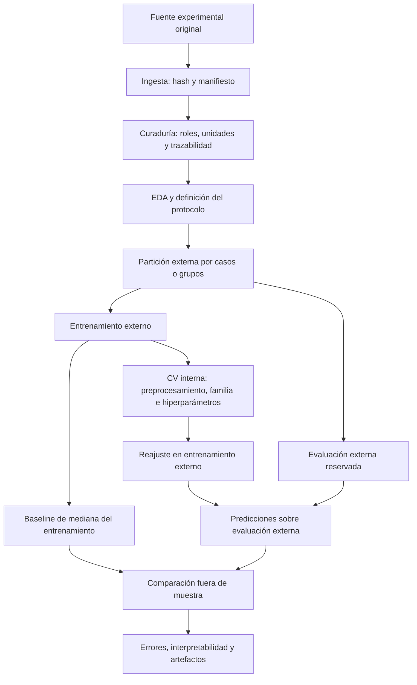

# Análisis predictivo e interpretable de la respuesta mecánica de estructuras pantográficas

Una estructura pantográfica es una red de barras delgadas o **fibras**, conectadas mediante pequeñas uniones llamadas **pivotes**. Sus espacios repetidos forman **celdas**. Se estudia como metamaterial mecánico porque la forma y organización de esa red contribuyen a su respuesta, además del material con el que se fabrica. Los especímenes de interés están hechos de **poliamida o nylon**, un polímero, mediante impresión 3D por **sinterización láser selectiva (SLS)**: un láser une selectivamente polvo del material, capa por capa.

En el ensayo se tira de la estructura y se registra la fuerza que resiste mientras se alarga. La tesis busca predecir **cuánta fuerza actúa cuando se rompe por primera vez una fibra o un pivote**: esa fuerza se llama **carga de primera falla**. Se utilizarán medidas geométricas y estructurales conocidas antes del ensayo. Es un problema de **regresión supervisada**: aprender de ejemplos con una fuerza medida para estimar un valor numérico en otros casos.

**Estado: PRELIMINAR — Proyecto de Investigación II.** Hay código y notebooks para el ciclo de ML, desde ingesta hasta ajuste, validación e interpretación. Todavía no hay una tabla experimental consolidada en el repositorio, modelos entrenados ni resultados predictivos. La primera falla puede dejar parte de la red funcionando: no equivale necesariamente a la fuerza máxima alcanzada, la falla total ni el colapso global.

## Autora

**Melissa Dessire Aylas Barranca**

Maestría en Ciencias con mención en Inteligencia Artificial

Universidad Nacional de Ingeniería (UNI)

## Resumen del proyecto

| Elemento | Explicación para el lector |
|---|---|
| Objeto de estudio | Una red de fibras delgadas conectadas por pivotes; se analiza cómo su geometría influye en el inicio de la rotura |
| Material | Poliamida, también llamada nylon; constituye las fibras y uniones y se mantiene como contexto del experimento |
| Fabricación | Impresión 3D SLS: construcción de la pieza por capas a partir de polvo de polímero unido mediante láser |
| Tipo de ensayo | Tracción: una máquina sujeta la pieza y separa sus extremos para estirarla, registrando fuerza y desplazamiento |
| Tipo de datos | Una tabla: cada fila representa un caso ensayado y las columnas contienen sus medidas y la fuerza de primera rotura |
| Entradas del modelo | Geometría disponible antes del ensayo: celdas, dimensiones de fibras y pivotes y otros descriptores verificados |
| Problema de ML | Regresión supervisada: aprender una relación entre esas medidas y una fuerza observada, y estimar la fuerza en casos no usados para aprender |
| Variable objetivo | **Carga de primera falla: fuerza registrada cuando ocurre el primer daño localizado de rotura de una fibra o un pivote** |
| Unidad de salida | Newton (N), unidad de fuerza; no es una masa en kilogramos ni un esfuerzo por unidad de área |
| Finalidad predictiva | Estimar el inicio del daño de configuraciones comparables a las ensayadas y estudiar qué características ayudan a esa estimación |
| Cómo se comprobará | Comparar predicciones con fuerzas reales de casos reservados para evaluación, frente a una referencia simple |

## Qué fuerzas y aspectos físicos intervienen

La **solicitación externa** de interés es la tracción: tirar de la pieza para alargarla. Dentro de la red, esa acción produce varios **mecanismos de deformación**. No deben confundirse las fuerzas aplicadas por la máquina con lo que sucede localmente en cada fibra o unión.

| Concepto | Qué significa físicamente | Papel en esta tesis |
|---|---|---|
| Fuerza de tracción | Acción que estira el espécimen; la máquina registra la fuerza transmitida | La fuerza en el primer evento de rotura es la respuesta a predecir |
| Desplazamiento | Cambio de posición impuesto a un extremo de la pieza, normalmente expresado en mm | Permite interpretar el ensayo; no es una entrada disponible antes de ensayar |
| Extensión de fibras | Alargamiento de sus elementos delgados | Mecanismo que ayuda a relacionar geometría y respuesta |
| Flexión de fibras | Curvatura de las fibras al deformarse la red | Explica por qué importan las dimensiones de su sección |
| Rotación y torsión de pivotes | Cambio relativo de orientación entre fibras; puede torcer las uniones | Sustenta estudiar la geometría de los pivotes |
| Cambio de ángulos de las celdas | Reorganización de la red; se describe también mediante deformación de corte o cizallamiento | Aspecto de la cinemática interna; no implica que se haya aplicado un ensayo externo independiente de corte |
| Carga y descarga | Aumento y reducción programados del desplazamiento durante el ensayo | Ayudan a observar deformación residual y disipación de energía; una descarga no debe etiquetarse automáticamente como rotura |
| Daño localizado y fallas sucesivas | Rotura de un elemento, seguida eventualmente de otras roturas | El target corresponde al **primer** evento; los posteriores no son nuevas muestras independientes |

Los mecanismos de extensión, flexión y deformación de pivotes están estudiados en los trabajos de [Turco y colaboradores](https://doi.org/10.1007/s00161-018-0678-y). La documentación experimental de Venditti describe tracción con ciclos de carga y descarga. El alcance actual no incluye predecir compresión, impacto, fatiga ni respuesta sísmica a partir de estos ensayos.

Para construir el target se deberá vincular el primer evento de rotura con su registro de fuerza. No basta con escoger el máximo de toda la curva fuerza–desplazamiento ni cualquier descenso de fuerza: puede haber máximos posteriores y descargas programadas. Los valores, unidades y criterio de identificación deberán quedar trazados a la fuente.

## Dataset

**Procedencia e investigador.** Enrico Venditti es el autor de la investigación doctoral sobre daño y resiliencia de materiales y estructuras complejas desarrollada en la **Università degli Studi di Sassari (Universidad de Sassari), Italia**, en el Departamento de Arquitectura, Diseño y Urbanismo y el programa de Arquitectura y Ambiente. Su trayectoria y línea de investigación se describen en su [perfil institucional](https://www.architettura.uniss.it/en/department/people/phd-student/enrico-venditti). El [repositorio de Sassari](https://iris.uniss.it/handle/11388/379270) registra la tesis doctoral y su discusión el 18 de febrero de 2026; la copia consultada indica curso académico 2024/2025.

El plan de tesis de Melissa identifica como fuente prevista la campaña experimental de Venditti y un archivo MATLAB proporcionado por Emilio Turco para fines académicos. Ese archivo aún no está incorporado al repositorio. La relación de entrega procede del plan de tesis; no se presume una colaboración institucional formal ni se atribuyen a Melissa los ensayos o resultados originales.

Una **campaña experimental** reúne especímenes y ensayos bajo un protocolo. El **dataset** será la tabla que se construya a partir de sus registros mediante extracción, revisión y decisiones documentadas. La campaña puede ampliarse durante la investigación.

| Aspecto | Descripción |
|---|---|
| Fuente | Registros de ensayos físicos de estructuras pantográficas y documentación de procedencia |
| Material, fabricación y ensayo | Poliamida/nylon, impresión SLS y tracción con seguimiento de fuerza y desplazamiento |
| Unidad de análisis | Un caso asociado con un espécimen ensayado; verificar correspondencia, réplicas y configuraciones relacionadas |
| Predictores | Medidas de la geometría y estructura que se conocerían antes de ensayar una pieza nueva |
| Target | Fuerza correspondiente al primer evento localizado de rotura, con unidad confirmada |
| Tipo de target | Número continuo: se estima una fuerza, no una categoría |
| Tamaño del conjunto | Se determinará a partir de la versión consolidada de los datos |
| Versionado | La ingesta registra observaciones, columnas, fecha UTC, SHA-256 y opciones de lectura por ejecución |
| Metadatos actuales | Se completarán automáticamente al ejecutar la ingesta sobre la versión consolidada |

El adaptador MATLAB queda pendiente de disponer del archivo y verificar su estructura. Actualmente se leen CSV y XLSX; cualquier exportación deberá conservar su relación con el original. Los PDF sirven para consulta: no se convierten automáticamente en un dataset ni se distribuyen con el proyecto.

### Pertinencia del material y de la investigación para Perú

La poliamida permite estudiar una arquitectura compleja producida por fabricación aditiva. Para el contexto peruano, el interés se apoya en capacidades y antecedentes de investigación locales: la PUCP registra un [trabajo sobre impresión de materiales de ingeniería, incluido nylon](https://tesis.pucp.edu.pe/items/211025b0-40d0-4eb5-b5e5-4fd5674eaf27), y su laboratorio [LIBRA](https://departamento-ingenieria.pucp.edu.pe/laboratorio/laboratorio-de-ingenieria-biomecanica-y-robotica-aplicada-libra/) estudia propiedades mecánicas de piezas impresas en 3D y desarrolla investigación en biomecánica y robótica.

| Nivel de pertinencia | Qué puede sostenerse |
|---|---|
| Material | El nylon es objeto de trabajo académico sobre impresión 3D en Perú; su estudio no está limitado al país de origen de los ensayos |
| Arquitectura | Como posibilidad de investigación, redes deformables podrían estudiarse para componentes ligeros y flexibles; esta tesis no demuestra una aplicación específica |
| Método | La ingesta, curaduría, regresión y validación pueden reutilizarse para futuras campañas locales de estructuras comparables |
| Transferencia experimental | Fabricar y ensayar especímenes en Perú permitiría comprobar si la respuesta y las predicciones se mantienen bajo las condiciones locales |

**La pertinencia local es una justificación de investigación, no una validación industrial.** El antecedente peruano citado sobre nylon se refiere a impresión por filamento, que no equivale a SLS. Para transferir resultados se deberán verificar grado de poliamida, proceso y orientación de fabricación, geometría, acondicionamiento del material y protocolo de ensayo. La tesis no presupone disponibilidad local de una máquina SLS específica ni certifica un producto médico o estructural.

## Variables del estudio

Estas variables están documentadas conceptualmente en la fuente de Venditti. Su presencia, nombre y unidad en la tabla consolidada deben verificarse antes de activarlas en `config/data_schema.yml`.

| Grupo | Variable conceptual | Tipo | Uso |
|---|---|---|---|
| Identificación | Identificador de caso | ID | Trazabilidad; nunca predictor |
| Geometría | Número de celdas en la dirección Y | Numérica discreta | Predictor candidato |
| Geometría | Altura y base de las fibras | Numérica continua | Predictores candidatos |
| Geometría | Altura y radio de los pivotes | Numérica continua | Candidatos; revisar constantes |
| Estructural | Longitud total de fibras y número de pivotes | Continua / discreta | Candidatos; revisar dependencia geométrica |
| Estructural | Volúmenes de fibras, pivotes y espécimen | Numérica continua | Candidatos; verificar fórmulas y redundancia |
| Respuesta | Carga de primera falla | Numérica continua | Target |

Las tablas de referencia rotulan longitudes en mm, volúmenes en mm³ y primera falla en N. Esto no verifica por sí solo las unidades de un archivo aún no recibido. Hay diferencias entre la tabla geométrica general y algunas fichas individuales que deben conciliarse contra la fuente original antes de consolidar datos.

La carga última, los desplazamientos y las energías medidos durante el ensayo no son entradas del modelo principal. Los eventos sucesivos de un mismo ensayo tampoco constituyen observaciones independientes. Los nombres conceptuales del YAML no se presentan como columnas reales detectadas.

## Estructura del repositorio

```text
T02_MIA14_SeccionB/
├── data/
│   ├── raw/                         # originales inmutables
│   ├── interim/                     # ingestas versionadas y manifiestos
│   └── processed/                   # tablas analíticas y reportes de curaduría
├── notebooks/
│   ├── 01_Ingesta_y_curaduria.ipynb
│   ├── EDA_basico.ipynb              # etapa 2; nombre existente conservado
│   ├── 03_Particiones_y_preprocesamiento.ipynb
│   ├── Baseline_basico.ipynb         # etapa 4; nombre existente conservado
│   ├── 05_Ajuste_y_validacion.ipynb
│   └── 06_Evaluacion_e_interpretabilidad.ipynb
├── src/
│   ├── __init__.py
│   ├── ingesta.py
│   ├── preprocesamiento.py          # curaduría determinística
│   ├── modelo_baseline.py
│   ├── modelos.py                   # pipelines y familias candidatas
│   ├── particiones.py               # folds, grupos y controles de viabilidad
│   ├── ajuste.py                    # búsqueda interna de hiperparámetros
│   ├── validacion.py                # evaluación externa y predicciones OOF
│   ├── interpretabilidad.py         # coeficientes e importancia por permutación
│   └── experimento.py               # inspección y ejecución explícita
├── config/
│   ├── data_schema.yml              # columnas, roles, unidades y curaduría
│   └── model_config.yml             # protocolo, familias, rejillas y ejecución
├── tests/
│   └── test_workflow.py             # contratos y aislamiento, sin entrenar
├── results/                         # experimentos locales versionados; vacío
├── logs/                            # registros locales de ejecución
├── slides/                          # reservado para presentaciones
├── README.md
├── requirements.txt
├── pyproject.toml
├── .gitignore
└── LICENSE
```

| Directorio | Contenido y regla |
|---|---|
| `data/raw/` | Datos originales: nunca editar ni sobrescribir; incorporar ampliaciones como archivos nuevos |
| `data/interim/` | Copias tabulares por ingesta; lectura y trazabilidad sin transformaciones aprendidas |
| `data/processed/` | Tabla analítica con roles explícitos y curaduría determinística; conserva valores faltantes de predictores |
| `results/` | Futuras predicciones, métricas, búsquedas, particiones y modelos; cada experimento tiene una versión propia |

La imputación, eliminación estadística de constantes y escalamiento ocurren en los pipelines de `modelos.py`, dentro de cada entrenamiento. No se aplican globalmente a `processed`. Datos, referencias privadas y artefactos de ejecución están excluidos de Git.

Los notebooks explican las decisiones y llaman a los módulos; la lógica reutilizable reside en `src/`. Esta separación evita que la tesis dependa de celdas ejecutadas en un orden desconocido.

## Flujo reproducible



| Etapa | Entrada | Proceso | Salida y estado |
|---|---|---|---|
| Ingesta | Original en `raw` | Lectura, hashes, dimensiones y esquema observado | `interim`; implementada, pendiente de datos reales |
| Curaduría | Ingesta + esquema revisado | Trazabilidad, tipos, faltantes, duplicados y revisión física | `processed`; controles preliminares implementados |
| EDA | Tabla curada | Distribuciones, faltantes, correlaciones y revisión de redundancia | Notebook preparado, sin resultados |
| Partición | Tabla, grupos y protocolo | CV externa e interna sin solapamiento | Índices y ordinales de origen; implementación preparada |
| Preprocesamiento | Entrenamiento de cada fold | Medianas, constantes y escalamiento según modelo | Transformadores ajustados dentro del pipeline; sin ejecutar |
| Baseline | Target del entrenamiento externo | Mediana | Referencia en las mismas particiones; sin ajustar |
| Ajuste o tuneo | Solo entrenamiento externo | `GridSearchCV` con MAE interno; selección de familia e hiperparámetros | Búsquedas y mejores configuraciones internas; sin ejecutar |
| Validación | Fold externo excluido del ajuste | Predicciones, errores y comparación contra baseline | Métricas por fold y OOF; sin resultados |
| Interpretación | Pipeline ajustado y observaciones externas | Coeficientes y permutación opcional | Diagnósticos previstos por fold; sin ejecutar |
| Reajuste final | Toda la tabla, tras evaluación | Nueva selección interna y ajuste para reutilización | Modelo opcional; no produce una evaluación independiente nueva |

**Fold** significa partición de validación cruzada; **OOF** significa predicciones obtenidas cuando cada observación estuvo fuera del entrenamiento. Ninguna de las etapas de entrenamiento se ha ejecutado en este avance.

## Curaduría y control de calidad de datos experimentales

**Curaduría** significa construir y documentar el dataset válido. **Preprocesamiento del modelo** significa ajustar transformaciones sobre entrenamiento. Son etapas distintas.

| Control | Alcance actual |
|---|---|
| Trazabilidad | Hash de fuente y tabla, versión de ingesta, configuración, índice de registro y exclusiones |
| Esquema | Encabezados no vacíos ni repetidos; columnas y roles explícitos antes de producir la tabla analítica |
| Faltantes y tipos | Reporte por columna; target numérico finito, nunca imputado; exclusión registrada del target ausente |
| Duplicados | Se reportan y conservan por defecto; eliminación exacta solo si se confirma que son duplicaciones de registro |
| Constantes | Se identifican para revisión; no se seleccionan variables automáticamente con todo el dataset |
| Unidades y anomalías físicas | Verificación manual de unidades, convenciones de signo y rangos; no se inventan umbrales ni conversiones |
| Réplicas y dependencia | Revisar identificadores repetidos y grupos; no confundir réplicas con duplicados |
| Redundancia | Revisar relaciones determinísticas y colinealidad; selección estadística posterior dentro de entrenamiento |
| Definición del target | Confirmar evento, criterio de detección y correspondencia con el registro de fuerza |

Solo se incluyen las columnas declaradas como target, predictores, identificadores o grupos. El script impide roles superpuestos, pero la revisión científica debe confirmar que ningún predictor procede de una respuesta del ensayo. Los marcadores de ausencia distintos de celdas vacías deben declararse en el YAML.

## Prevención de fuga de información

| Operación | Puede hacerse antes del split | Debe ajustarse solo con train |
|---|---:|---:|
| Renombrar columnas | Sí | No |
| Convertir unidades con regla fija y documentada | Sí | No |
| Eliminar duplicados exactos confirmados | Sí | No |
| Derivar variables con fórmulas físicas predefinidas | Sí | No |
| Imputación estadística | No | Sí |
| Escalamiento | No | Sí |
| Selección supervisada o basada en la distribución | No | Sí |
| Ajuste de hiperparámetros | No | Sí, con validación interna |

Las réplicas y registros relacionados deben permanecer en el mismo grupo de partición. El EDA previo puede describir calidad; las decisiones de selección, transformación y ajuste guiadas por datos deben quedar dentro del entrenamiento. El test o los pliegues externos no se usan para elegir modelos ni hiperparámetros.

## Baseline y modelos candidatos

El **baseline** es una referencia mínima: predecir para todos los casos externos la mediana de la carga observada **solo en entrenamiento**. Si un método complejo no mejora esa referencia fuera de muestra, su complejidad no queda justificada por el error predictivo.

| Familia | Qué representa | Estado de la implementación |
|---|---|---|
| Ridge | Relación lineal con penalización para controlar coeficientes | Pipeline y rejilla preliminar |
| Elastic Net | Relación lineal con regularización combinada; puede reducir contribuciones redundantes | Pipeline y rejilla preliminar |
| Árbol de regresión | Reglas sucesivas que dividen el espacio geométrico | Pipeline con control de profundidad y tamaño de hojas |
| Bosque aleatorio | Promedio de varios árboles de regresión | Pipeline y rejilla preliminar |
| Proceso gaussiano | Relación no lineal definida mediante un kernel de similitud | Pipeline y búsqueda preliminar; intervalos calibrados pendientes |
| Red neuronal de regresión | Combinación no lineal de entradas mediante capas | Constructor disponible; deshabilitado por defecto hasta justificar su complejidad |

Los rangos en `config/model_config.yml` son puntos de partida revisables, no valores óptimos. Cada pipeline incluye imputación de medianas, eliminación de constantes y escalamiento cuando corresponde. Los árboles conservan la escala original. Si una columna está completamente ausente en algún entrenamiento, se detiene el protocolo para revisar esa representación.

No hay modelo ganador ni se presupone que una red neuronal será superior. Agregar familias o ampliar rejillas después de ver los errores externos modifica el experimento y exige una nueva evaluación.

### Cómo se separan ajuste y validación

1. Reservar un fold externo, manteniendo juntos los registros dependientes.
2. Dividir únicamente el entrenamiento externo en folds internos.
3. Ajustar cada pipeline y sus hiperparámetros en esos folds; seleccionar por MAE interno.
4. Elegir la familia por ese criterio interno y reajustarla en todo el entrenamiento externo.
5. Predecir el fold externo una sola vez para evaluación y comparar contra la mediana del mismo entrenamiento.
6. Repetir y conservar todas las predicciones externas, configuraciones y advertencias.

La salida `selected` evalúa este procedimiento completo. Los errores externos por familia se conservan para diagnóstico; elegir una familia utilizando esos errores y reportar el mismo error como evaluación final produciría una estimación optimista. Este diseño sigue la separación descrita en la [documentación de validación cruzada anidada de scikit-learn](https://scikit-learn.org/stable/auto_examples/model_selection/plot_nested_cross_validation_iris.html).

## Evaluación

| Métrica | Rol | Interpretación |
|---|---|---|
| MAE | Principal | Error absoluto medio en unidades de carga |
| RMSE | Complementaria | Error en unidades de carga; penaliza más los errores grandes |
| R² | Complementaria | Proporción de variación explicada fuera de muestra; puede ser negativa; indefinida con target constante o menos de dos observaciones |
| MedAE | Complementaria | Mediana del error absoluto; medida robusta en unidades de carga |

La comparación contra el baseline será siempre **fuera de muestra**, considerando variabilidad entre particiones. No se usan matriz de confusión, accuracy, precision, recall ni F1 para el problema principal: el target es continuo y la tarea es regresión.

## Interpretabilidad

| Enfoque | Qué permite examinar | Alcance actual |
|---|---|---|
| Intrínseco: coeficientes lineales | Dirección y magnitud de asociaciones, considerando escalas y colinealidad | Extracción por fold para el modelo seleccionado cuando es lineal |
| Post hoc: permutación | Cuánto aumenta el MAE al perturbar una entrada externa | Disponible de forma opcional; deshabilitada por defecto |
| SHAP | Contribuciones a predicciones bajo un método de referencia | Extensión pendiente, condicionada al modelo y a la dependencia entre entradas |
| PDP/ALE | Forma de la relación estimada entre una entrada y la respuesta | Extensión pendiente; requiere comprobar combinaciones físicamente plausibles |

No todos los modelos son interpretables por construcción. La importancia por permutación puede alterarse por predictores correlacionados o crear combinaciones incompatibles con relaciones geométricas. Se revisarán estabilidad entre folds y coherencia con extensión/flexión de fibras y deformación de pivotes; no se utilizarán estas explicaciones externas para retunear el mismo experimento.

**Importancia predictiva no implica causalidad física.** Las explicaciones deben contrastarse con conocimiento mecánico y sus limitaciones. Los coeficientes guardados corresponden a entradas estandarizadas en su entrenamiento; no se presentan como leyes constitutivas ni parámetros materiales identificados.

## Reproducibilidad

| Artefacto | Registro previsto por el código |
|---|---|
| Dataset | Fecha UTC, dimensiones y hash de fuente, tabla intermedia y tabla curada |
| Código y entorno | Commit Git, cambios locales, Python y dependencias instaladas |
| Curaduría | Contenido/hash del esquema, columnas, ordinales y exclusiones |
| Protocolo | Configuración completa, justificación, seed, estrategia y rejillas |
| Particiones | Índices externos/internos y vínculo con ordinales de origen |
| Preprocesamiento y modelo | Pipeline ajustado de cada familia/fold, con parámetros aprendidos, en formato joblib |
| Búsqueda interna | Combinaciones evaluadas, puntuaciones internas y configuración seleccionada |
| Predicciones y errores | OOF por caso, procedimiento, fold y familia; residuos observada − predicha |
| Métricas | MAE, RMSE, R² y MedAE por fold y agregadas; comparación pareada con baseline |
| Interpretación | Coeficientes y, si se activa, importancia por permutación por fold |
| Integridad | Manifiesto de experimento y hashes de sus artefactos |
| Logs | `pipeline.log`, `data_quality.log`, `modeling.log`; advertencias y fallos |

Las versiones anteriores no se sobrescriben. Una ejecución interrumpida conserva salidas parciales con `failure.json` y no se considera completa sin `experiment_manifest.json`. El modelo final opcional se etiqueta como reajuste sobre todos los datos. Guardar versiones no sustituye congelar el entorno y conservar el commit definitivo antes de reportar resultados.

## Cómo ejecutar el pipeline

Desde la raíz, con Python 3.11 o superior:

```bash
python -m venv .venv
```

Activar con `.venv\Scripts\Activate.ps1` en PowerShell, `.venv\Scripts\activate.bat` en CMD o `source .venv/bin/activate` en Linux/macOS. Después:

```bash
python -m pip install -r requirements.txt
```

### Datos y curaduría

1. Incorporar un original autorizado en `data/raw/`; CSV UTF-8 separado por comas o XLSX. Para una hoja específica usar `--sheet NOMBRE`. Los números deben usar punto decimal. Se preserva texto como `NA`; Excel no permite recuperar ceros iniciales guardados únicamente como formato visual.
2. Sustituir el nombre del archivo y ejecutar:

   ```bash
   python src/ingesta.py --input data/raw/NOMBRE_ARCHIVO.csv
   ```

3. Completar `config/data_schema.yml` con columnas reales, roles, unidades y marcadores de ausencia. Sustituir `VERSION` por la ingesta informada:

   ```bash
   python src/preprocesamiento.py --input data/interim/VERSION/dataset_interim.csv
   ```

4. Revisar el reporte y seguir los notebooks en este orden:

| Orden | Notebook | Decisión o producto |
|---|---|---|
| 1 | `01_Ingesta_y_curaduria.ipynb` | Procedencia, target, unidades, exclusiones y tabla curada |
| 2 | `EDA_basico.ipynb` | Distribuciones, faltantes, relaciones y anomalías |
| 3 | `03_Particiones_y_preprocesamiento.ipynb` | Justificación de grupos, folds y transformaciones internas |
| 4 | `Baseline_basico.ipynb` | Referencia de mediana sobre los mismos folds |
| 5 | `05_Ajuste_y_validacion.ipynb` | Búsquedas internas, selección y evaluación externa |
| 6 | `06_Evaluacion_e_interpretabilidad.ipynb` | Métricas reales, residuos, importancia y limitaciones |

### Inspección sin entrenamiento

El comando siguiente existe y puede ejecutarse ahora. Con la configuración distribuida informa que faltan datos y protocolo; no produce métricas:

```bash
python -m src.experimento --check
```

Las pruebas del avance validan contratos, construcción sin ajuste, separación de grupos e índices de CV; no entrenan estimadores:

```bash
python -m unittest discover -s tests -v
```

### Ejecución futura con datos y protocolo revisados

En `config/model_config.yml`, indicar `data.model_table`, justificar la estrategia, definir folds/grupos, revisar rejillas y marcar `protocol.reviewed: true`. El entrenamiento permanece desactivado mientras `execution.allow_training` sea `false`.

Solo después de completar esa revisión y habilitar explícitamente el entrenamiento:

```bash
python -m src.experimento --run
```

Para añadir un reajuste final después de la evaluación, sin atribuirle una nueva métrica independiente:

```bash
python -m src.experimento --run --fit-final
```

Estos comandos de entrenamiento están implementados, pero **no se han ejecutado**. El comando histórico `python src/modelo_baseline.py` solo muestra un aviso; el baseline se integra en la validación común para asegurar comparabilidad.

## Resultados esperados del avance

El avance entrega una estructura de investigación completa a nivel de flujo: documentación física, procedencia, curaduría, seis notebooks y módulos para particiones, pipelines, ajuste, validación e interpretación. Los contratos e índices se verifican con pruebas de software que no representan datos experimentales.

Permanecen pendientes la fuente original, la conciliación científica, el diccionario definitivo, la elección justificada de grupos/folds y la ejecución real. Las extensiones de incertidumbre calibrada, SHAP/PDP/ALE y análisis estadístico de estabilidad requieren desarrollo y validación adicionales. No hay valores de desempeño, predicciones, modelos ganadores ni conclusiones experimentales en este avance.

## Roadmap

| Fase | Actividad |
|---|---|
| 1 | Recibir fuente original, verificar exportación, ingesta y versionado |
| 2 | Conciliar discrepancias, completar diccionario, curaduría y EDA |
| 3 | Definir particiones y ejecutar baseline |
| 4 | Comparar modelos candidatos y ajuste interno |
| 5 | Validar fuera de muestra e interpretar estabilidad y coherencia física |
| 6 | Consolidar código, entorno, datos autorizados y artefactos reproducibles |

## Referencias

Referencias verificadas en los documentos consultados; los documentos fuente no se distribuyen con el proyecto.

- Aylas Barranca, M. D. (2026). *Análisis predictivo e interpretable de la respuesta mecánica de estructuras pantográficas mediante aprendizaje automático supervisado aplicado a datos experimentales*. Plan de tesis, Universidad Nacional de Ingeniería.
- Venditti, E. (2026; copia consultada: curso académico 2024/2025). *Analisi strutturale per lo studio del danneggiamento in materiali e strutture complesse*. Tesis doctoral, Università degli Studi di Sassari. [Registro institucional](https://iris.uniss.it/handle/11388/379270).
- Turco, E., Golaszewski, M., Giorgio, I. y Placidi, L. (2017). *Can a Hencky-Type Model Predict the Mechanical Behaviour of Pantographic Lattices?* En *Mathematical Modelling in Solid Mechanics*, pp. 285–311. [DOI: 10.1007/978-981-10-3764-1_18](https://doi.org/10.1007/978-981-10-3764-1_18).
- Turco, E., Misra, A., Sarikaya, R. y Lekszycki, T. (2019; publicación en línea en 2018). *Quantitative analysis of deformation mechanisms in pantographic substructures: experiments and modeling*. *Continuum Mechanics and Thermodynamics*, 31, 209–223. [DOI: 10.1007/s00161-018-0678-y](https://doi.org/10.1007/s00161-018-0678-y).

- Toyama Higa, P. M. (2022). *Diseño mecatrónico de un sistema de calefacción cerrado y deshumedecedor de materiales de ingeniería para impresoras 3D de escritorio de código libre*. PUCP. [Repositorio institucional](https://tesis.pucp.edu.pe/items/211025b0-40d0-4eb5-b5e5-4fd5674eaf27).
- PUCP. *Laboratorio de Ingeniería Biomecánica y Robótica Aplicada (LIBRA)*. [Descripción institucional](https://departamento-ingenieria.pucp.edu.pe/laboratorio/laboratorio-de-ingenieria-biomecanica-y-robotica-aplicada-libra/).
- Scikit-learn. *Nested versus non-nested cross-validation*. [Documentación oficial](https://scikit-learn.org/stable/auto_examples/model_selection/plot_nested_cross_validation_iris.html).

## Licencia

El **código** se distribuye para uso académico y de investigación en el marco de la UNI, según `LICENSE`. Los **datos experimentales** conservan las condiciones de sus titulares; su publicación o redistribución requiere autorización expresa. La disponibilidad del código no otorga derechos sobre los datos o documentos consultados. `.gitignore` excluye los PDF, las referencias privadas y los datos de ejecución.
