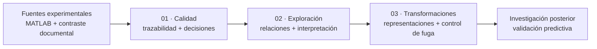

# Caracterización estadístico-mecánica de estructuras pantográficas

**Universidad Nacional de Ingeniería · Facultad de Ingeniería Industrial y de Sistemas**<br>
Maestría en Inteligencia Artificial · Trabajo de Investigación II · MIA, 4.º ciclo, sección B · **2026-2**<br>
**Investigadora:** Melissa Dessire Aylas Barranca · **Docente:** Glen Dario Rodríguez Rafael

> **Título académico:** ANÁLISIS EXPLORATORIO Y CARACTERIZACIÓN ESTADÍSTICO-MECÁNICA DE ESTRUCTURAS PANTOGRÁFICAS: CALIDAD DE DATOS, GEOMETRÍA Y RESPUESTA EXPERIMENTAL.

Se investiga cómo la geometría de fibras y pivotes y la arquitectura de un retículo se relacionan con su respuesta al ensayo de tracción. El objetivo posterior es **predecir la carga de primera falla, en newtons, utilizando únicamente información conocida antes del ensayo**. Esta entrega establece la evidencia exploratoria y las condiciones necesarias para ese modelado.

Una estructura pantográfica es una red de dos familias de fibras conectadas por pivotes deformables. Su interés como metamaterial mecánico reside en diseñar la respuesta mediante la arquitectura, además del material constituyente. Estudiar las relaciones geometría–respuesta permite formular hipótesis, detectar redundancias y evitar interpretar una correlación inducida por el diseño como una ley física.

**Ruta de lectura:** [informe académico](docs/informe_eda.md) · [diccionario](docs/diccionario_datos.md) · [trazabilidad](docs/trazabilidad_datos.md) · [EDA ejecutado en HTML](reports/02_EDA_Avanzado.html).

## Índice

- [Experimento y objetivo](#experimento-y-objetivo)
- [INPUT, target y OUTPUT](#input-target-y-output)
- [Tres cuadernos para la entrega](#tres-cuadernos-para-la-entrega)
- [Preguntas y análisis](#preguntas-y-análisis)
- [Hallazgos e implicancias](#hallazgos-e-implicancias)
- [Calidad y límites](#calidad-y-límites)
- [Estructura del proyecto](#estructura-del-proyecto)
- [Reproducción](#reproducción)
- [Etapa predictiva posterior](#etapa-predictiva-posterior)
- [Fuentes y privacidad](#fuentes-y-privacidad)

## Experimento y objetivo

| Aspecto | Definición y alcance |
|---|---|
| Fuente experimental | Archivo MATLAB recibido, contrastado con el capítulo 9 y el apéndice de la tesis doctoral de Enrico Venditti |
| Procedencia académica | Venditti: doctorado en Arquitectura y Ambiente, Università degli Studi di Sassari, Italia; portada 2024/2025. El plan de tesis 2026 registra la provisión académica de datos por Emilio Turco |
| Material y fabricación | Poliamida —nylon— mediante sinterización láser selectiva, según la tesis |
| Arquitectura | Fibras cruzadas y pivotes; familias de discretización del retículo |
| Envolvente nominal | 210 × 70 mm; más celdas no significa mayor longitud exterior |
| Ensayo documentado | Tracción con carga y descarga; velocidad de desplazamiento de 15 mm/min y niveles nominales cada 10 mm |
| Respuesta objetivo | Fuerza asociada al primer evento de rotura identificado de una fibra o un pivote |
| Estado científico | Exploración reproducible del archivo recibido; diferencias geométricas MATLAB–PDF registradas y pendientes de conciliación |

La fuerza mide la acción aplicada; el desplazamiento mide el cambio de posición. Una deformación unitaria requeriría definir una longitud de referencia. Tras la primera rotura pueden quedar elementos conectados que transmitan carga: **primera falla, rotura terminal y máximo global no son equivalentes**.

La [introducción científica](docs/introduccion_experimento.md) explica los mecanismos y las fuentes. La metodología es pertinente para investigación peruana en diseño y fabricación; su transferencia a otro material, proceso o aplicación requiere verificación experimental local.


*Esquema idealizado, sin escala; no reproduce exactamente una probeta ni simula su deformación. Fuente conceptual contrastada en la trazabilidad.*

## INPUT, target y OUTPUT

**INPUT** es una característica disponible antes del ensayo. **OUTPUT** es una respuesta obtenida durante o después. El **target** es el OUTPUT elegido como objetivo predictivo.

| Rol | Variables reales | Unidad | Uso |
|---|---|---|---|
| INPUT · arquitectura | `n_cells_Y`, `Pivot_total_number` | conteos | Celdas en Y y cantidad de pivotes |
| INPUT · fibras | `Fiber_height`, `Fiber_base`, `Fiber_total_length` | mm | Dimensiones y longitud declarada de fibras |
| INPUT · pivotes | `Pivot_height`, `Pivot_radius` | mm | Geometría local de conexiones |
| INPUT · volúmenes | `Fiber_total_volume`, `Pivot_total_volume`, `Sample_total_volume` | mm³ | Volúmenes declarados de componentes y volumen CAD del espécimen |
| **Target** | **`First_Failure_Load_N`** | **N** | **Carga de primera falla: fuerza del primer evento de rotura identificado en la fuente** |
| OUTPUT · evento terminal | `Ultimate_Load` | N | Fuerza asociada a rotura terminal; no máximo global automático |
| OUTPUT · desplazamientos | `Maximum_Displacement`, `residual_Displacement_*` | mm | Respuesta global y residual por ciclo |
| OUTPUT · energías | `Energy_Dissipated`, `Energy_Fracture` | mJ | Resúmenes por ciclo y evento; unidad cotejada en el apéndice |
| Metadato | `Case_n` | identificador | Trazabilidad; excluido de los predictores |

La relación futura de regresión es **F_primera_falla = f(X_geometría, X_estructura) + error**. Su salida será una fuerza estimada en N para una configuración comparable. Energías, cargas posteriores, residuales y cantidades de eventos **no son entradas admisibles** para predecir antes del ensayo.

El [diccionario completo](docs/diccionario_datos.md), también en [CSV](docs/diccionario_datos.csv), documenta definición física, símbolo, unidad, fuente, fórmula, dominio, disponibilidad temporal y fuga. Distingue datos tabulados, cálculos determinísticos y proxies geométricos. El target ausente no se imputa.

## Tres cuadernos para la entrega

| Orden | Cuaderno y reporte de lectura | Contenido |
|---:|---|---|
| **01** | [Ingesta, curaduría y calidad](notebooks/01_Ingesta_Curaduria_y_Calidad.ipynb) · [HTML](reports/01_Ingesta_Curaduria_y_Calidad.html) | Fundamento, fuentes, concordancia, esquemas, ausencias, duplicados, configuraciones y decisiones |
| **02** | [Análisis estadístico y mecánico](notebooks/02_EDA_Avanzado.ipynb) · [HTML](reports/02_EDA_Avanzado.html) | Distribuciones, asociaciones completas, familias, incertidumbre, influencia, geometría, ciclos y fractura |
| **03** | [Transformaciones y preparación](notebooks/03_Diseno_de_Particiones_y_Preprocesamiento.ipynb) · [HTML](reports/03_Diseno_de_Particiones_y_Preprocesamiento.html) | Fórmulas geométricas, representaciones, logaritmos, aislamiento del escalamiento y protocolo conservado |

Los tres conservan código y resultados visibles. Los HTML permiten revisar sin instalar Jupyter: desde GitHub, descargarlos y abrirlos en el navegador; el informe y los notebooks pueden revisarse en el repositorio. El nombre histórico del cuaderno 03 conserva la continuidad del proyecto; su título y contenido priorizan transformaciones.



## Preguntas y análisis

| Eje científico | Análisis y evidencia | Pregunta |
|---|---|---|
| Calidad y procedencia | Concordancia MATLAB–CSV, hashes, tipos, ausencias por configuración, duplicados e incidencias documentales | ¿Qué se midió, qué falta y qué puede compararse? |
| Caracterización | Media, mediana, dispersión, cuantiles, IQR, MAD, CV, asimetría, curtosis, ECDF y extremos | ¿Cómo varían geometría y respuesta? |
| INPUT–INPUT | Pearson/Spearman, identidades, redundancia, VIF y valores singulares | ¿Qué descriptores repiten información? |
| INPUT–OUTPUT | Pearson, Spearman, Kendall, soporte efectivo y omisión de caso | ¿Qué geometrías se asocian con la primera falla y otras respuestas? |
| OUTPUT–OUTPUT | Cargas, desplazamientos, energía y dependencias algebraicas | ¿Qué respuestas describen aspectos distintos del ensayo? |
| Arquitectura y confusión | Variación entre/dentro de familia, contrastes y perfiles | ¿Qué patrones proceden del diseño? |
| Robustez | IQR/MAD, Cook, leverage, bootstrap, permutaciones y FDR BH/BY | ¿Cuánto dependen los hallazgos de casos y supuestos? |
| Multivariado | PCA, escalas/representaciones y diagnóstico de agrupamientos | ¿Cómo se organiza el espacio geométrico? |
| Mecánica experimental | Residuales por ciclo, complemento nominal y energías por evento | ¿Qué describe la evolución observada del daño? |
| Preparación posterior | Áreas, razones, segundos momentos ideales y escalamiento solo en train | ¿Qué representaciones pueden evaluarse sin fuga? |

Las figuras se exportan en **PNG de 300 dpi o superior y SVG**. Las tablas técnicas conservan los tamaños efectivos. El [informe](docs/informe_eda.md) responde RQ1–RQ12 y conecta resultados, interpretación, límites y recomendaciones experimentales.

## Hallazgos e implicancias

| Evidencia calculada | Interpretación defendible | Implicancia |
|---|---|---|
| El 96,55 % de la variación observada de primera falla corresponde a diferencias entre familias | La arquitectura organiza la distribución; no es precisión predictiva | Separar relaciones globales y dentro de familia |
| Volumen CAD–primera falla: r = 0,773 y ρ = 0,799; asociación condicionada ρ = −0,265 | La tendencia global mezcla familias; el intervalo condicionado incluye cero | No atribuir un efecto causal a incrementar volumen |
| Ninguna asociación condicionada supera FDR BH del 5 % | Los efectos independientes del agrupamiento permanecen inciertos | Formular hipótesis y obtener evidencia adicional |
| Volúmenes declarados de fibras+pivotes suman 6524,01 mm³ | Su anticorrelación responde a una restricción; la suma no es el volumen CAD | Controlar redundancia de entradas |
| Energía del primer evento–primera falla: ρ = 0,988; rango por omisión 0,986–0,992 | Asociación estable entre respuestas del mismo ensayo | Interpretación mecánica; excluir del INPUT previo |
| Mediana residual/amplitud nominal: 0,452 → 0,677 en cohorte común | Aumenta la fracción residual mediana con ciclo/amplitud | No confundir con fatiga ni recuperación independiente |
| Mediana fuerza/pivote: 0,594; 0,589; 0,852 N/pivote para Y = 4/5/6 | La diferencia 4–5 se atenúa con ese denominador | La normalización no mide la fuerza interna de cada unión |
| Representación original: rango numérico 7 entre 9 columnas variables; núcleo propuesto: 5 de 5, con tolerancia relativa 10⁻¹⁰ | Hay redundancia lineal, sin contar redondeo como nueva dimensión | Comparar representaciones dentro de validación posterior |

La relación volumen–carga también es sensible a la omisión dentro de algunas familias: su signo puede cambiar en Y = 4 y Y = 6. Las discrepancias geométricas con las fichas limitan la atribución mecánica. Evidencia: [cuaderno 02](notebooks/02_EDA_Avanzado.ipynb), [tablas completas](reports/eda_relaciones/tables/) y [síntesis](reports/eda/hallazgos.md).

## Calidad y límites

Un hash correcto acredita integridad del archivo; no demuestra que su geometría coincida con la ficha definitiva. La auditoría distingue ambas comprobaciones.

- **Geometrías discrepantes:** tabla general, fichas y MATLAB difieren en campos identificados. Se documentan valores y páginas sin correcciones automáticas.
- **Carga terminal reportada:** su definición conceptual se verifica en el protocolo, pero hay discordancias numéricas frente a los picos del apéndice. El caso 27 requiere aclaración: `Ultimate_Load` coincide numéricamente con el desplazamiento máximo. Se conserva el valor recibido y se limita su interpretación.
- **Esquema actual e histórico:** `Fiber_base` existe en la fuente y el snapshot anterior, pero no está seleccionada en el esquema actual. Describirla en el EDA no la incorpora al modelo.
- **Ausencias y dependencia:** ausencia no equivale a cero ni a inexistencia de un evento. Los ciclos del mismo espécimen no se tratan como ensayos independientes; identificadores únicos no prueban independencia.
- **Inferencia exploratoria:** remuestreo y permutaciones dependen de intercambiabilidad. El rango por omisión no es un intervalo de confianza. La separación de clusters es modesta y no define nuevos tipos físicos.
- **Mecánica:** existen curvas como figuras PDF, pero el MATLAB contiene resúmenes. No se reconstruyen curvas, rigidez experimental, esfuerzo, tenacidad ni histéresis a partir de máximos o agregados.
- **Generalización:** nuevas campañas, materiales, procesos o arquitecturas requieren validación. Se necesitan fichas reconciliadas, réplicas identificadas y datos instrumentales.

Documentación: [informe de curaduría](docs/informe_curaduria.md) · [trazabilidad y discrepancias](docs/trazabilidad_datos.md).

## Estructura del proyecto

La estructura separa evidencia, decisiones metodológicas, implementación y resultados. Cada resultado debe poder rastrearse hasta la fuente y las decisiones de análisis.

```text
T02_MIA14_SeccionB/
├── docs/
│   ├── introduccion_experimento.md    # Mecánica y ensayo explicados
│   ├── diccionario_datos.md          # Definiciones, unidades, fórmulas y roles
│   ├── diccionario_datos.csv
│   ├── trazabilidad_datos.md         # Fuente, página, definición y discrepancias
│   ├── informe_curaduria.md          # Evidencia y decisiones de calidad
│   └── informe_eda.md                # Interpretación académica y RQ1–RQ12
├── config/
│   ├── data_schema.yml
│   └── model_config.yml
├── data/
│   ├── raw/dati_campagna_venditti.m
│   ├── interim/preliminary/
│   ├── processed/preliminary/
│   └── README.md
├── demo/
│   └── index.html
├── notebooks/
│   ├── 01_Ingesta_Curaduria_y_Calidad.ipynb
│   ├── 02_EDA_Avanzado.ipynb
│   ├── 03_Diseno_de_Particiones_y_Preprocesamiento.ipynb
│   ├── 04_Baseline_de_Referencia.ipynb
│   ├── 05_Entrenamiento_Ajuste_y_Validacion.ipynb
│   └── 06_Evaluacion_Final_e_Interpretabilidad.ipynb
├── reports/
│   ├── 01_Ingesta_Curaduria_y_Calidad.html
│   ├── 02_EDA_Avanzado.html
│   ├── 03_Diseno_de_Particiones_y_Preprocesamiento.html
│   ├── 04_Baseline_de_Referencia.html
│   ├── 05_Entrenamiento_Ajuste_y_Validacion.html
│   ├── 06_Evaluacion_Final_e_Interpretabilidad.html
│   ├── metricas_modelos_preliminares.csv
│   ├── resumen_modelado_preliminar.json
│   ├── eda_calidad/                  # Auditoría, PNG/SVG, CSV y manifiesto
│   ├── eda_relaciones/               # Matrices completas, soporte y sensibilidad
│   ├── eda_transformaciones/         # Representaciones y aislamiento en train
│   └── eda/
│       ├── figures/                # figuras científicas exportables
│       ├── tables/                 # resultados exploratorios en CSV
│       ├── hallazgos.md            # evidencia, límites y decisiones
│       └── manifest.json          # hashes y parámetros de cálculo
├── src/
│   ├── importar_matlab.py
│   ├── eda_calidad.py
│   ├── eda_relaciones.py
│   ├── transformaciones_eda.py
│   ├── eda.py
│   ├── eda_energia.py
│   ├── verificar_eda.py              # Contrasta outputs, enlaces, hashes y figuras
│   ├── reporte_eda.py
│   ├── ingesta.py
│   ├── preprocesamiento.py
│   ├── particiones.py
│   ├── modelos.py
│   ├── modelo_baseline.py
│   ├── ajuste.py
│   ├── validacion.py
│   ├── interpretabilidad.py
│   └── experimento.py
├── tests/
│   ├── test_workflow.py
│   ├── test_eda.py
│   ├── test_eda_energia.py
│   ├── test_eda_calidad.py
│   ├── test_eda_relaciones.py
│   └── test_transformaciones_eda.py
├── results/                         # ejecuciones locales fechadas
│   └── VERSION/
│       ├── fold_01/ ... fold_05/    # búsquedas, pipelines e interpretación
│       ├── oof_predictions.csv
│       ├── fold_metrics.csv
│       ├── evaluation.json
│       ├── splits.json
│       ├── final_model.joblib
│       ├── final_model_info.json
│       └── experiment_manifest.json
├── logs/
├── slides/
├── requirements.txt
├── pyproject.toml
└── README.md
```

### Datos

| Ruta | Responsabilidad | Regla |
|---|---|---|
| `data/raw/` | Fuente experimental original | Se conserva sin modificaciones |
| `data/interim/preliminary/` | Tabla extraída, hash y manifiesto | Etapa intermedia visible antes de seleccionar variables |
| `data/processed/preliminary/` | Tabla analítica y reporte de calidad | Versión preliminar para revisión, todavía no definitiva |
| `results/` | Predicciones, métricas, modelos e interpretación | Una carpeta nueva por experimento |
| `reports/` | HTML de notebooks, métricas CSV y resumen JSON | Evidencia exploratoria; subcarpetas temáticas con tablas CSV, PNG/SVG y manifiestos |
| `logs/` | Eventos, advertencias y fallos | Complementan los manifiestos |

### Demostrador

| Ruta | Responsabilidad |
|---|---|
| `demo/index.html` | Prototipo interactivo y autónomo; funciona sin instalar dependencias web |
| `data/processed/preliminary/` | Proporciona rangos verificables para controlar el dominio de entrada |
| Futuro servicio de inferencia | Cargará el pipeline validado y devolverá predicción y explicación |

**Interim** significa etapa intermedia: traduce la fuente MATLAB a una tabla verificable, pero todavía no es la entrada definitiva del modelo. Las ejecuciones fechadas permanecen fuera de Git; las carpetas `preliminary/` son copias estables para que el profesor pueda revisar la evidencia.

La ampliación del conjunto depende de nuevos ensayos o simulaciones físicamente validadas, con una fuente y un protocolo documentados.

### Configuración

| Archivo | Responsabilidad |
|---|---|
| `config/data_schema.yml` | Target, identificadores, predictores, unidades y reglas de curaduría |
| `config/model_config.yml` | Ruta real de datos, protocolo preliminar, modelos y rejillas; listo para ejecutar |

### Código científico

| Módulo | Responsabilidad |
|---|---|
| `importar_matlab.py` | Extrae la tabla `samples` sin ejecutar código MATLAB |
| `eda_calidad.py` | Audita concordancia, ausencias, configuraciones e incidencias sin reemplazar snapshots |
| `eda_relaciones.py` | Matrices completas, tamaño efectivo, caracterización y sensibilidad por pareja |
| `transformaciones_eda.py` | Fórmulas geométricas, representaciones y verificación del preprocesamiento |
| `eda.py` | Asociaciones globales/condicionadas, permutaciones, bootstrap, FDR y diagnósticos de influencia |
| `eda_energia.py` | Extrae de forma restringida matrices energéticas para interpretación posensayo |
| `verificar_eda.py` | Verifica ejecución guardada, enlaces, hashes y exportaciones sin recalcular |
| `reporte_eda.py` | Ejecuta los tres cuadernos exploratorios y exporta HTML con navegación |
| `ingesta.py` | Valida la fuente, calcula SHA-256 y crea la versión intermedia |
| `preprocesamiento.py` | Construye la tabla analítica y registra exclusiones y calidad |
| `particiones.py` | Genera folds externos e internos y protege grupos relacionados |
| `modelos.py` | Define los seis candidatos y su preprocesamiento |
| `modelo_baseline.py` | Implementa la mediana y las métricas de regresión |
| `ajuste.py` | Ejecuta el tuneo exclusivamente en CV interna |
| `validacion.py` | Produce predicciones OOF y compara candidatos con el baseline |
| `interpretabilidad.py` | Extrae coeficientes e importancia por permutación |
| `experimento.py` | Orquesta el protocolo y guarda artefactos reproducibles |

### Notebooks

| Orden | Notebook | Función |
|---:|---|---|
| 1 | `01_Ingesta_Curaduria_y_Calidad.ipynb` | Procedencia, esquema, calidad, exclusiones y tabla analítica |
| 2 | `02_EDA_Avanzado.ipynb` | EDA integral: familias, interacciones, robustez, geometría, ciclos y energías |
| 3 | `03_Diseno_de_Particiones_y_Preprocesamiento.ipynb` | Transformaciones geométricas, escalas, representaciones y protocolo conservado |
| 4 | `04_Baseline_de_Referencia.ipynb` | Referencia de valor central en los folds externos |
| 5 | `05_Entrenamiento_Ajuste_y_Validacion.ipynb` | Tuneo interno y predicción externa |
| 6 | `06_Evaluacion_Final_e_Interpretabilidad.ipynb` | Métricas, residuos, estabilidad y explicación |

Los notebooks documentan la investigación. La lógica reutilizable permanece en `src/` y las pruebas de contratos están en `tests/`.

## Reproducción

Desde la raíz Git, en la rama `eda`:

```powershell
python -m venv .venv
.\.venv\Scripts\Activate.ps1
python -m pip install -r requirements.txt
python -m src.reporte_eda --execute --all
python -m pytest tests -q
python -m src.verificar_eda
```

El comando ejecuta los cuadernos 01→02→03 desde kernels limpios y guarda outputs. Las nuevas ejecuciones de ingesta/curaduría quedan versionadas; los snapshots históricos `preliminary/` se verifican y conservan. Los manifiestos registran hashes, parámetros y versiones.

`.gitattributes` conserva los bytes de las fuentes y artefactos con SHA-256 para que Git no altere sus huellas al convertir saltos de línea entre plataformas.

Solo análisis 02: `python -m src.reporte_eda --execute`. Solo exportación HTML desde outputs existentes: `python -m src.reporte_eda --all`.

Los documentos interpretan esta versión de resultados. Si cambia la fuente, deben revisarse también las cifras y conclusiones del informe y README. Los PDF privados se necesitan para repetir el cotejo documental, pero no para recalcular las tablas y figuras del archivo MATLAB disponible.

## Etapa predictiva posterior

Se conservan los módulos y cuadernos 04–06 del trabajo previo. No se reentrenan ni se atribuyen sus métricas a esta entrega exploratoria.

| Modelo existente | Función en la comparación |
|---|---|
| Ridge | Referencia lineal regularizada |
| Elastic Net | Regularización con variables correlacionadas |
| SVR con kernel RBF | Relaciones no lineales suaves |
| Árbol de regresión | Reglas e interacciones interpretables |
| Bosque aleatorio | Agregación de árboles |
| Proceso gaussiano RBF | Relación no lineal con supuestos explícitos de covarianza |

El baseline aprende la mediana solo del entrenamiento: permite contrastar el error absoluto con una regla elemental. La MLP dispone de un constructor experimental; TabNet y FT-Transformer son propuestas sujetas a soporte y validación, sin resultados de deep learning atribuidos a este EDA.

| Métrica prevista | Interpretación |
|---|---|
| **MAE [N]** | Error absoluto medio; criterio principal de selección |
| RMSE [N] | Penaliza especialmente errores grandes |
| MedAE [N] | Error absoluto mediano |
| R² fuera de muestra | Comparación con variabilidad de la respuesta; puede ser negativo |
| Diferencia de MAE frente al baseline | Reducción del error frente a la regla sin geometría |

La comparación requiere preprocesamiento dentro de train, selección interna y evaluación externa. Réplicas o lotes confirmados deben permanecer juntos. Evaluar una arquitectura nueva no equivale a repartir aleatoriamente casos de arquitecturas conocidas.

El producto de tesis previsto es un **modelo versionado, pipeline de inferencia y demostrador de predicción estructural**. El [HTML preliminar](demo/index.html) conserva ese planteamiento; no es un simulador de elementos finitos ni demuestra operación mecánica en tiempo real.

## Fuentes y privacidad

- **Venditti, E.** *Analisi strutturale per lo studio del danneggiamento in materiali e strutture complesse*. Tesis doctoral, Università degli Studi di Sassari, año académico 2024/2025 en portada. Capítulo 9 y apéndice; páginas precisas en [trazabilidad](docs/trazabilidad_datos.md).
- **Aylas Barranca, M. D. (2026).** Plan de tesis UNI. Procedencia académica registrada en páginas PDF 24 y 26.
- **Turco y colaboradores (2017, 2019).** Antecedentes Hencky y Piola–Hencky; referencias verificadas y diferencias de protocolo en [introducción](docs/introduccion_experimento.md).
- **Métodos:** [SciPy: Spearman](https://docs.scipy.org/doc/scipy/reference/generated/scipy.stats.spearmanr.html), [control FDR](https://docs.scipy.org/doc/scipy/reference/generated/scipy.stats.false_discovery_control.html) y [scikit-learn: preprocesamiento](https://scikit-learn.org/stable/modules/preprocessing.html).

Se conserva el MATLAB previamente incorporado al proyecto; no se agregan PDF privados. `.gitignore` excluye PDF, referencias privadas, modelos ajustados y ejecuciones locales. La licencia del código no implica permiso adicional sobre documentos de terceros. Se trabaja en **`eda`**, sin merge ni cambios en `main`.
