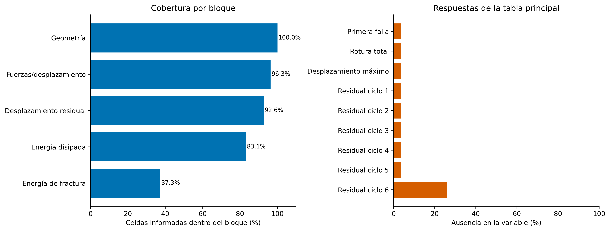
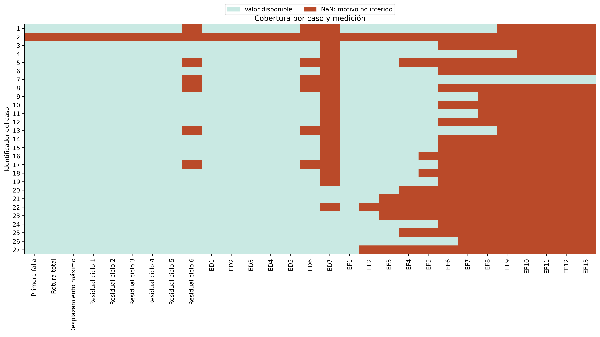
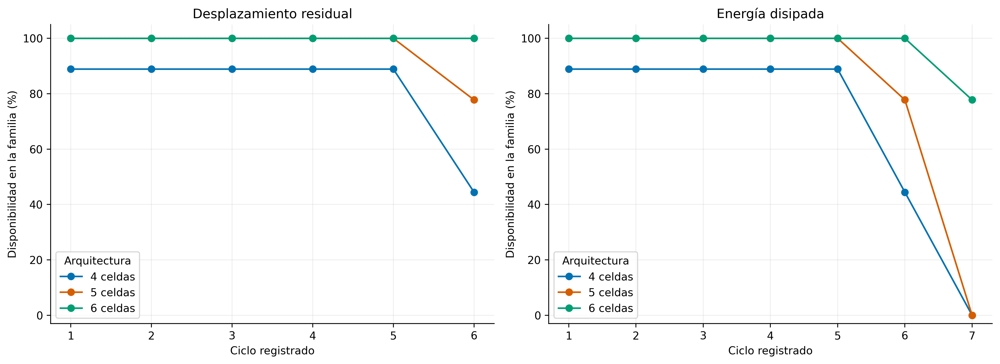
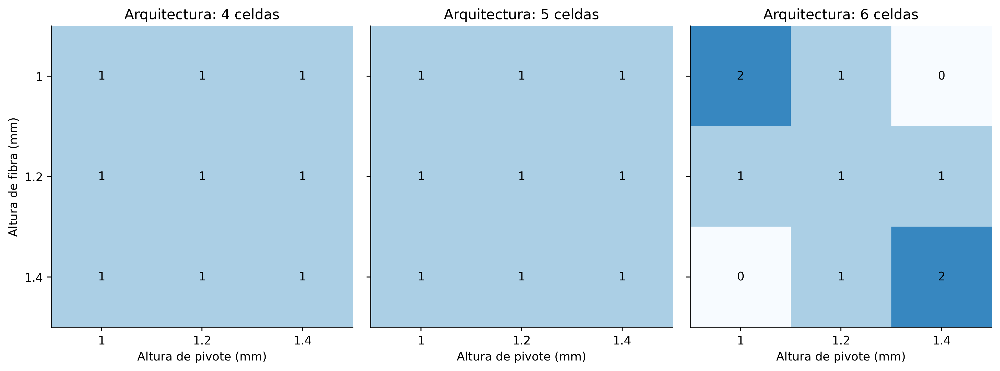
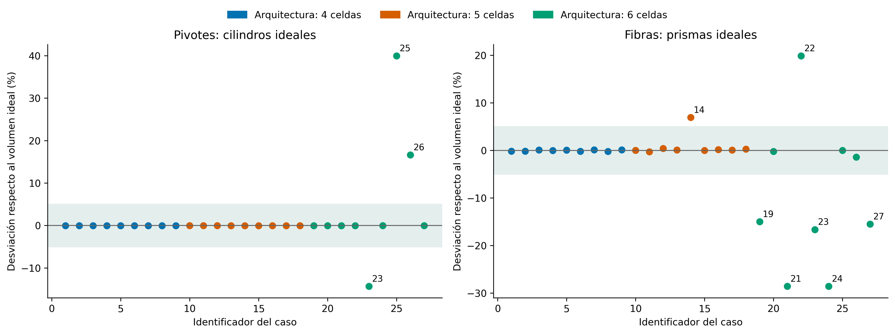
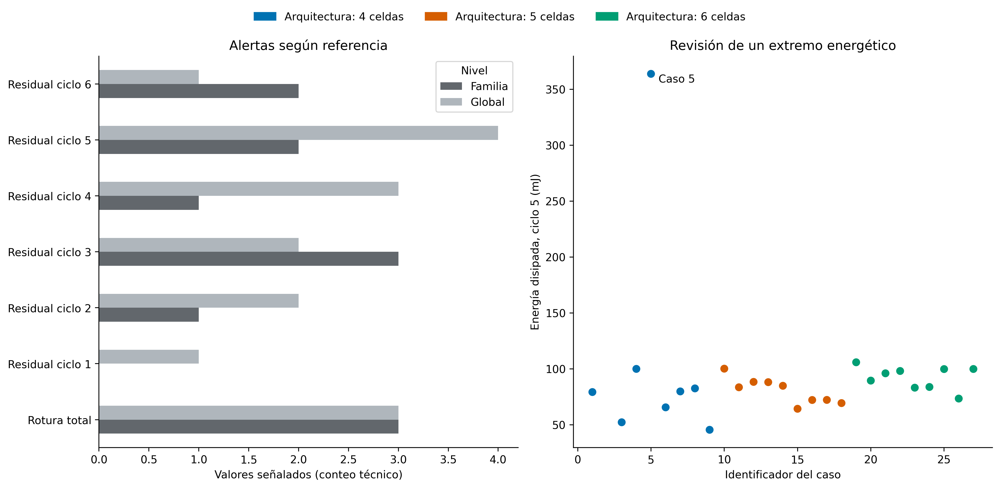

# Informe de curaduría y calidad experimental

**Universidad Nacional de Ingeniería · FIIS · Maestría en Inteligencia Artificial**<br>
**Trabajo de Investigación II · MIA, 4.º ciclo, sección B · 2026-2**<br>
**Docente:** Glen Dario Rodríguez Rafael<br>
**Investigadora:** Melissa Dessire Aylas Barranca

## Propósito y alcance

La auditoría evalúa extracción MATLAB–Python, disponibilidad de mediciones y consistencia de geometría y respuestas pantográficas. La carga de primera falla es el objetivo predictivo futuro. No se imputan objetivos ni se confunden respuestas medidas en el ensayo con entradas previas. La fidelidad digital y la concordancia documental son verificaciones diferentes.

La fuente digital es `data/raw/dati_campagna_venditti.m`. El [fundamento](introduccion_experimento.md), el [diccionario](diccionario_datos.md) y la [trazabilidad](trazabilidad_datos.md) contienen definiciones, unidades y discrepancias. Las dimensiones exteriores documentadas son 210 × 70 mm: la familia de celdas indica arquitectura, no aumento demostrado del tamaño exterior.

## Integridad y reproducción

La ingesta y curaduría se ejecutaron en nuevos directorios fechados. Las fuentes, los snapshots preliminary y el esquema se conservaron intactos, con hashes antes/después. La comprobación independiente verificó valores y NaN de todos los vectores; la reconstrucción con el esquema histórico coincide con el snapshot procesado. El esquema actual omite Fiber_base, presente en fuente y snapshot histórico: diferencia de selección, no pérdida de información.

Los hashes de los snapshots coinciden con sus manifiestos; las rutas internas describen corridas históricas. Se registra la ubicación actual sin reescribir la procedencia. Véase [comparación ejecutada](../reports/eda_calidad/tables/03_equivalencia.csv).

## Completitud y dependencia

La geometría está completa. El residual del sexto ciclo presenta 25.93% de ausencia; su máscara coincide con la sexta disipación. El caso 2 carece de outputs, que la fuente indica deben revisarse. No se interpreta como fuerza cero ni como ensayo inexistente.

La cobertura del séptimo ciclo energético está concentrada en la familia de seis celdas. Comparar valores disponibles de ciclos distintos puede cambiar la composición; se requiere cohorte común. Los motivos individuales no permiten certificar mecanismos MCAR, MAR o MNAR. Las posiciones vacías de fractura pueden estar reservadas o carecer de medición: el caso 5 tiene un cuarto evento en la tabla de picos (PDF 129), pero su energía es NaN (PDF 131). El número de energías observadas no equivale al número total de fracturas.







## Configuraciones y réplicas

No se detectaron filas exactamente duplicadas, identificadores repetidos ni columnas numéricamente idénticas. Repetir factores parciales no acredita geometría completa idéntica ni réplicas. La familia de seis celdas presenta cobertura no uniforme en la rejilla de alturas del MATLAB; discrepancias con la tesis afectan parte de esa familia. Ciclos y eventos pertenecen al mismo caso y no son nuevas unidades experimentales independientes.



## Consistencia geométrica, signos y extremos

La suma de volúmenes declarados de fibras y pivotes es 6524.01 mm³: dependencia algebraica que no equivale automáticamente al volumen CAD. El contraste cilíndrico señala los casos 23, 25, 26; la idealización prismática también presenta diferencias. El 5 % se usa para inspección, no como tolerancia experimental validada.

Se preservan negativos de energía inicial y el extremo del caso 5, ciclo 5 (363.8487 mJ). No se aplicó eliminación por IQR/MAD, truncamiento ni relleno con ceros. La unidad mJ está verificada en fichas PDF 117/121, no inferida a partir de magnitudes.





## Decisiones justificadas

| Variable | Problema | Evidencia | Posible causa | Impacto | Tratamiento | Justificación |
| --- | --- | --- | --- | --- | --- | --- |
| First_Failure_Load_N | Resumen no idéntico a primer pico en algunas fichas | Casos 3, 9, 12: resumen vs primer Upper Force; ver trazabilidad | Selección operacional o redondeo por aclarar | El evento exacto no se reconstruye solo del resumen | Conservar target publicado; documentar discrepancia | No sustituir el target por otro campo sin revisar protocolo |
| Outputs del caso 2 | Ausencia conjunta | Caso 2; comentario fuente: outputs por revisar | Problemas en outputs según fuente/apéndice | Sin objetivo observado para supervisión | Conservar geometría; excluir solo de análisis que requiere objetivo | No inventar respuesta ni afirmar ensayo inexistente |
| Residual 6 / disipación 6 | Coausencia | Máscaras idénticas por caso | Causa individual no documentada | Composición cambia entre ciclos | Contrastar cohorte común y pares disponibles | Separar trayectoria de selección |
| Disipación ciclo 7 | Cobertura por familia | Solo familia de seis celdas | Diseño o desarrollo; por confirmar | Sin comparación entre todas las familias | No imputar otros grupos | Ausencia no equivale a energía nula |
| Energy_Fracture | Posiciones finales vacías | NaN y longitudes observadas variables | Posiciones reservadas o falta documental | Conteo observado no certifica todos los eventos | Usar secuencia observada; no NaN como cero | Evitar inventar energía total |
| Disipación ciclo 1 | Negativos | Casos: 3, 5, 9, 11, 13, 15, 16, 17, 18, 26 | Convención/procesamiento/resolución por verificar | Logaritmo directo no admisible en todos los valores | Preservar signos; cotejar curvas | Sin fundamento para truncar o usar valor absoluto |
| Disipación ciclo 5 | Extremo | Caso 5: 363.8487 mJ | Respuesta real o incidencia no resuelta | Influencia en resúmenes/asociaciones | Conservar y evaluar sensibilidad | Extremo no demuestra error |
| Fiber_base | Selección histórica distinta | Snapshot la incluye; esquema actual la excluye | Evolución de configuración | Reproducir con otro esquema cambia columnas | Mantener ambos estados; EDA usa columna existente | Selección no equivale a inexistencia |
| Pivot_radius | Constante | Radio único: 0.5 mm | Diseño sin variación de radio | No se estima asociación ni efecto del radio | Conservar; excluir del ajuste por varianza nula | No confundir falta de variación con falta de efecto |
| Volumen/altura de pivotes | Desviación de cilindro ideal | Casos: 23, 25, 26 | Definición o registro; diferencias PDF–MATLAB | Afecta variables derivadas | Señalar y contrastar sensibilidad | 5 % no es tolerancia metrológica |
| Fiber_base / Pivot_height | Diferencia PDF–MATLAB | Caso 14: base PDF 1.66 mm vs MATLAB 1.56 mm; alturas de pivote: casos 21, 23, 24, 25, 26 | Versión/transcripción no resuelta | Geometría documental no unívoca | Conservar .m y cotejo por página | No elegir una fuente como verdad sin validación |
| Fichas de tesis | Campos geométricos desplazados | Casos 5, 12, 13; ver trazabilidad | Maquetación/etiquetado | La corrección automática con PDF puede ser errónea | Revisión por variable y caso | El PDF también requiere contraste |
| V_fibras + V_pivotes | Identidad algebraica | Suma 6524.01 mm³ | Restricción del diseño/construcción de campos | Redundancia determinística | Controlar selección conjunta | No atribuir efectos independientes |
| Sample_total_volume | CAD distinto de suma | Diferencia CAD−suma variable | Definición CAD/intersecciones; por cotejar | Normalizaciones pueden confundirse | Mantener definiciones diferenciadas | Suma de partes no reemplaza volumen CAD |
| Factores parciales repetidos | Réplica no acreditada | Tabla 09_configuraciones_repetidas | Otras dimensiones difieren | Dependencia no completamente documentada | No promediar ni multiplicar unidades por ciclo | Faltan espécimen/lote/réplica |
| Ultimate_Load | Respuesta de rotura total | Puede ser menor que primera falla; tesis cap.9 | Daño progresivo compatible, no probado por agregados | Confundir con máximo crea falsas incoherencias | Tratar como output posterior | No reconstruir curvas a partir de agregados |
| Energías | Unidad no indicada en .m | mJ en fichas PDF 117/121 | Metadatos omitidos en script | Posibles etiquetas/conversiones erróneas | Registrar mJ con fuente; sin modificar valores | Unidad documental, no inferida de magnitud |
| Manifiestos preliminary | Ruta histórica | Hash válido; ruta de corrida original | Copia de snapshot | Ubicación actual diferente | Separar ubicación y procedencia | Integridad no exige ruta idéntica |

## Limitaciones y requerimientos experimentales

Faltan identidad física de especímenes/réplicas, lotes, causas individuales de ausencia y resolución de diferencias documentales. Algunas fichas PDF contienen campos desplazados; no se usaron como reemplazo automático del MATLAB. Curvas numéricas son necesarias para rigidez o integración energética. Los agregados no justifican reconstruir histéresis ni confirmar mecanismos. Verificar importación no certifica calibración ni causalidad.

## Reproducción y evidencias

```powershell
python -m src.eda_calidad --execute
```

[Notebook ejecutado](../notebooks/01_Ingesta_Curaduria_y_Calidad.ipynb) · [HTML](../reports/01_Ingesta_Curaduria_y_Calidad.html) · [Manifiesto](../reports/eda_calidad/manifest.json) · [Decisiones CSV](../reports/eda_calidad/tables/14_decisiones.csv)

Las figuras se exportan en PNG a 320 dpi y SVG. Las tablas incluyen tamaños efectivos pertinentes, sin hacer del total global el eje de la narrativa. No se entrenaron modelos en esta auditoría.
