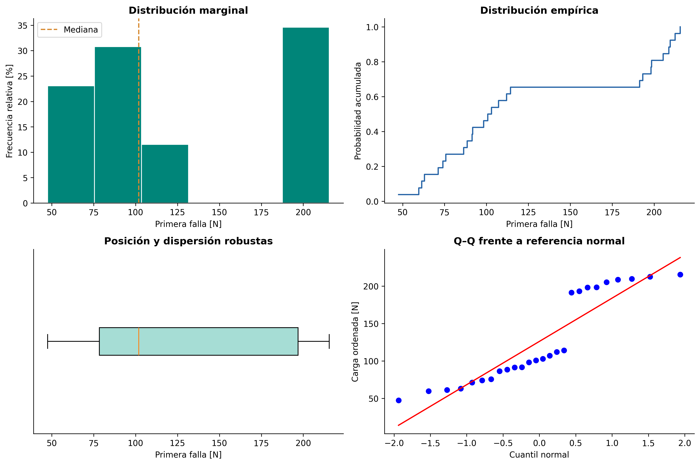
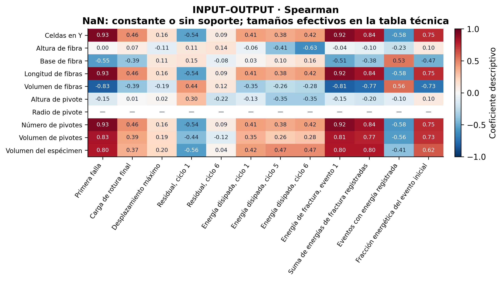
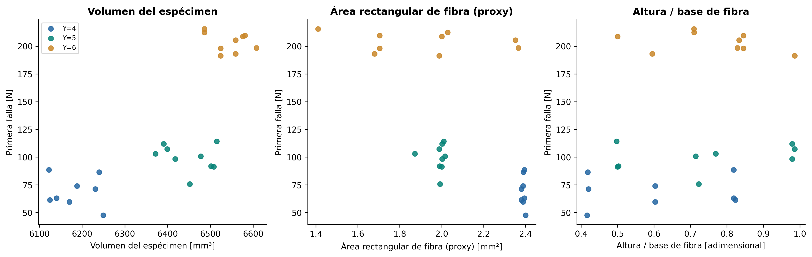
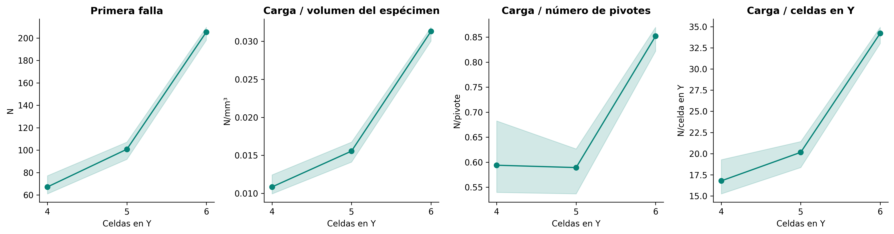
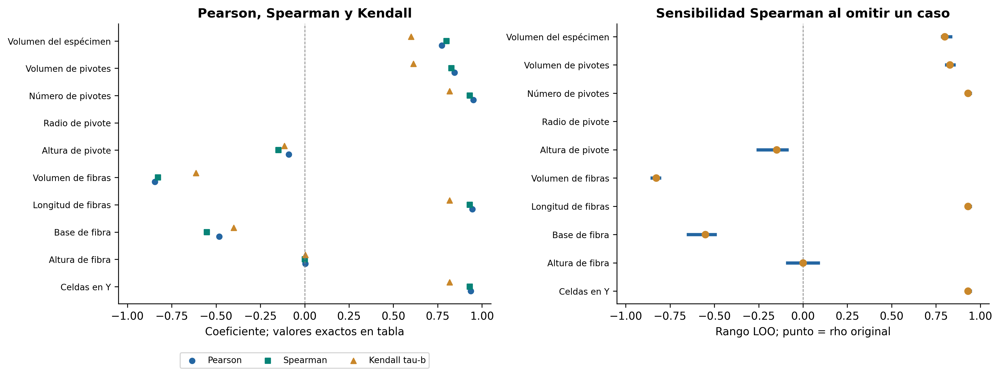
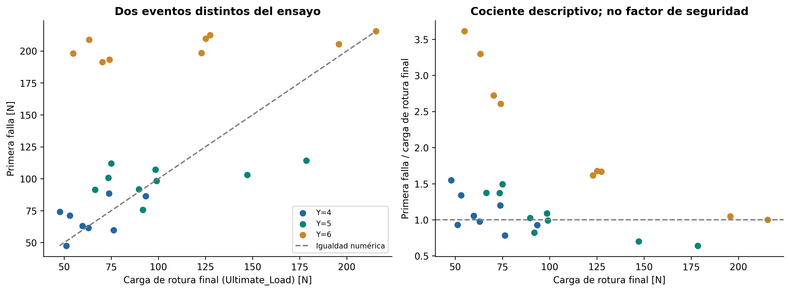
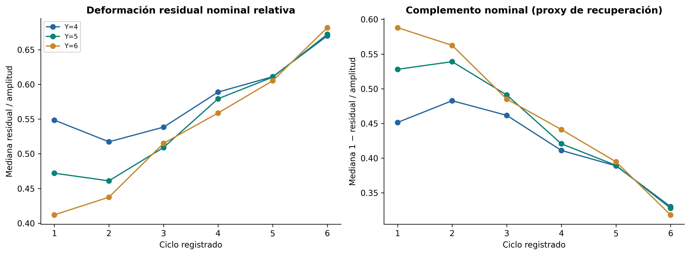
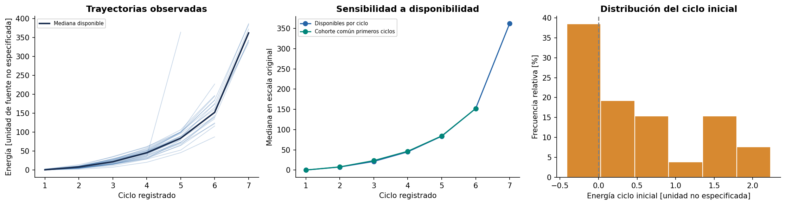
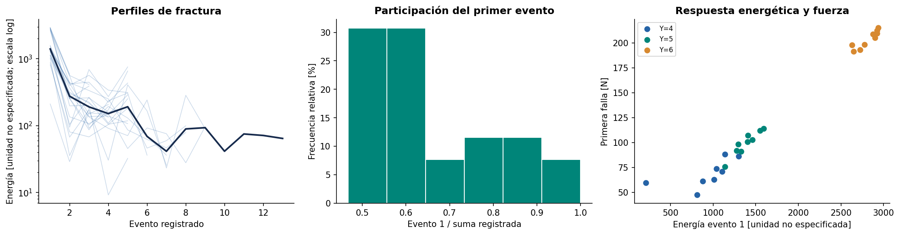
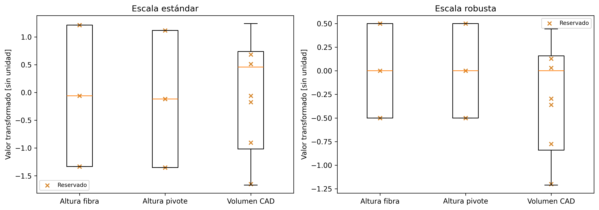

# ANÁLISIS EXPLORATORIO Y CARACTERIZACIÓN ESTADÍSTICO-MECÁNICA DE ESTRUCTURAS PANTOGRÁFICAS: CALIDAD DE DATOS, GEOMETRÍA Y RESPUESTA EXPERIMENTAL

**Universidad Nacional de Ingeniería** 
**Facultad de Ingeniería Industrial y de Sistemas — Maestría en Inteligencia Artificial** 
**Curso:** Trabajo de Investigación II · **Ciclo y sección:** MIA, 4.º ciclo, sección B · **Periodo:** 2026-2 
**Docente:** Glen Dario Rodríguez Rafael 
**Investigadora:** Melissa Dessire Aylas Barranca

## Resumen

Se estudia la relación entre arquitectura, geometría y respuestas de estructuras pantográficas ensayadas a tracción con ciclos de carga y descarga. El objetivo predictivo posterior es estimar la fuerza de primera falla a partir de características conocidas antes del ensayo. Esta entrega verifica fuentes, audita datos y examina asociaciones, redundancia, sensibilidad e incertidumbre.

La familia definida por celdas en Y concentra el 96.55 % de la variación observada de primera falla entre grupos; esta separación no mide precisión predictiva. La asociación positiva global volumen–primera falla cambia al comparar dentro de familia, con incertidumbre compatible con ausencia de relación condicionada. Los volúmenes de fibras y pivotes son complementarios por construcción. La energía del primer evento de fractura mantiene una asociación intensa con primera falla, pero es una respuesta posterior al ensayo y no un predictor admisible.

La revisión documental verifica unidades energéticas en mJ y precisa que la carga terminal no es el máximo global. Detecta también discrepancias geométricas entre el archivo digital, la tabla general y fichas individuales. Se conservan las fuentes y se explicitan estas limitaciones. El aporte es una caracterización reproducible y una formulación defendible de las hipótesis de modelado, sin afirmar causalidad ni desempeño fuera de muestra.

## Índice

1. [Contexto y problema](#1-contexto-y-problema)
2. [Fuentes y variables](#2-fuentes-y-variables)
3. [Metodología](#3-metodología)
4. [Calidad y curaduría](#4-calidad-y-curaduría)
5. [Distribuciones y familias](#5-distribuciones-y-familias)
6. [Relaciones geométrico-mecánicas](#6-relaciones-geométrico-mecánicas)
7. [Redundancia y análisis multivariado](#7-redundancia-y-análisis-multivariado)
8. [Estabilidad e incertidumbre](#8-estabilidad-e-incertidumbre)
9. [Respuestas secundarias, ciclos y energías](#9-respuestas-secundarias-ciclos-y-energías)
10. [Transformaciones y modelado posterior](#10-transformaciones-y-modelado-posterior)
11. [Preguntas de investigación](#11-preguntas-de-investigación)
12. [Interpretación de resultados](#12-interpretación-de-resultados)
13. [Conclusiones y reproducción](#13-conclusiones-y-reproducción)
14. [Referencias](#14-referencias)

## 1. Contexto y problema

Un metamaterial mecánico obtiene parte de su comportamiento de la geometría y disposición de sus componentes. Una estructura pantográfica contiene dos familias de fibras conectadas mediante pivotes deformables. La literatura representa extensión y flexión de fibras y microtorsión de pivotes en modelos discretos; estos mecanismos orientan hipótesis, pero una correlación no identifica por sí misma su contribución. [V, PDF 91; T17, PDF 3–4 / pp. 287–288; T19, PDF 2–4 / pp. 210–212.]

La campaña se documenta en la tesis doctoral de Enrico Venditti, Università degli Studi di Sassari, año académico 2024/2025. Los especímenes se diseñaron en SolidWorks y se fabricaron por sinterización láser selectiva de poliamida. Se fijaron dimensiones externas nominales de **210 × 70 mm**, con criterio de masa idéntica o similar; variaron alturas de fibras y pivotes y celdas en Y. El ensayo fue de tracción con carga–descarga a **15 mm/min**, con niveles nominales separados **10 mm**. La condición de masa es un criterio documentado, no una masa medida verificable en cada fila. [V, PDF 1, 94–96.]

La fuerza se expresa en N y el desplazamiento en mm. La deformación describe cambios de forma o dimensiones; no se calcula deformación unitaria sin longitud de referencia apropiada. La **carga de primera falla**, First_Failure_Load_N, es la fuerza asociada al primer evento identificado de rotura de una fibra o un pivote. El daño local no implica necesariamente pérdida inmediata de toda capacidad de carga: la fuente registra secuencias de rotura y respuesta posterior. Ultimate_Load corresponde al evento terminal reportado y no al máximo global de toda la curva.

El problema futuro es **F_FF = f(X_geometría, X_estructura) + ε**. Las X deben conocerse antes del ensayo; ε reúne variación no explicada y limitaciones de medición y modelo. El EDA caracteriza esa información; no demuestra aquí capacidad predictiva.

**Figura 1. Del diseño al análisis estadístico.** Pregunta: ¿qué se mide y para qué? Esquema conceptual original apoyado en el protocolo de Venditti; no reproduce un espécimen ni simula su deformación. Separa geometría previa de respuestas posteriores. Variables y unidades: [diccionario](diccionario_datos.md); fundamento: [introducción](introduccion_experimento.md).

## 2. Fuentes y variables

La fuente operativa es data/raw/dati_campagna_venditti.m: una tabla de geometría y respuestas y matrices energéticas. La unidad primaria es el caso experimental identificado por Case_n. Los ciclos y eventos son mediciones relacionadas dentro del caso, no especímenes adicionales.

En las leyendas, **S1** identifica el archivo MATLAB y **S2** la tesis doctoral de Venditti, citada como **V** en las referencias.

Se examinaron el capítulo 9 y apéndice A de Venditti, los artículos Hencky y Piola–Hencky y el plan de tesis de Melissa Aylas Barranca (2026), que declara la provisión académica de la campaña por Emilio Turco. Los artículos contextualizan otras estructuras; sus sensores, módulos o condiciones de borde no se trasladan a esta campaña.

| Familia | Información | Unidad | Papel |
|---|---|---|---|
| Arquitectura | Celdas en Y, longitud de fibras, pivotes | conteo, mm | Entradas previas parcialmente redundantes |
| Geometría local | Base/altura de fibra, altura/radio de pivote | mm | Entradas candidatas |
| Volúmenes | Fibras, pivotes, espécimen | mm³ | Entradas con definición y versiones por conciliar |
| Cargas | Primera falla y evento terminal | N | Target y respuesta secundaria |
| Desplazamientos | Máximo y residuales | mm | Respuestas secundarias |
| Energías | Disipación por ciclo y energía por evento | mJ | Respuestas posteriores al ensayo |
| Metadatos | Caso y posición de ciclo/evento | sin unidad | Trazabilidad, no característica mecánica |

El [diccionario](diccionario_datos.md) y su [CSV](diccionario_datos.csv) describen cada variable mediante diecisiete campos, incluidos fuente, fórmula, unidad, nivel de observación y fuga de información. La [trazabilidad](trazabilidad_datos.md) registra páginas y discrepancias. La energía en mJ se verifica explícitamente en las tablas del apéndice, por ejemplo PDF 117 y 121.

## 3. Metodología

La auditoría verifica extracción literal de MATLAB, tablas procesadas, identificadores, tipos, ausencias, duplicados, constantes, restricciones y extremos. Los faltantes permanecen como tales: no se imputan respuestas ni se eliminan casos por una regla automática de atípicos.

El análisis univariado incluye posición, dispersión, cuantiles, IQR, MAD, coeficiente de variación, asimetría, curtosis y concentración. Se comparan distribuciones globales y por arquitectura. Las relaciones se evalúan con Pearson, Spearman y Kendall tau-b, con tamaños efectivos por par, empates y sensibilidad a omisión individual.

Se distinguen asociación global, asociación dentro de familia y correlación de rangos residualizados por familia. Para esta última, las permutaciones se restringen a cada familia y el bootstrap remuestrea dentro de ella. Los intervalos dependen de la intercambiabilidad de casos dentro de familia y no corrigen lotes o réplicas desconocidos. Los valores p son exploratorios y se complementan con correcciones BH/BY; no sustituyen magnitud, soporte o interpretación física.

El rango por omisión individual **LOO no es un intervalo de confianza ni una validación predictiva**. El diagnóstico OLS describe influencia bajo una formulación concreta. Los ciclos se comparan con disponibilidad variable y con cohorte común. PCA y agrupamientos se usan como diagnósticos geométricos, sin convertirlos en mecanismos físicos.

Las transformaciones geométricas son determinísticas. Imputación y escalamiento aprendidos se verifican solo con entrenamiento en una demostración de aislamiento, separada del estudio de desempeño.

## 4. Calidad y curaduría

La auditoría confirma equivalencia MATLAB→tabla intermedia y la reconstrucción del snapshot curado histórico. Distingue, además, una divergencia de configuración: el esquema predictivo actual omite Fiber_base, aunque el campo se conserva en el snapshot y en el EDA. No se modifica silenciosamente esa selección histórica.

La concordancia informática no garantiza coherencia documental. Los valores digitales de cargas, desplazamientos y energías reproducen los resúmenes de las fichas examinadas; ello no resuelve discrepancias frente a los picos por evento, incluido el caso 27. Además, varias geometrías discrepan con la tabla general PDF 95 y con fichas individuales. En PDF 129, 164 y 169 hay valores bajo encabezados incongruentes; por ello el PDF no se utiliza como corrector automático.

| Problema | Evidencia | Efecto y tratamiento |
|---|---|---|
| Ausencia conjunta de respuestas | Caso 2, problema de outputs documentado en PDF 113 | Conservar geometría; excluir solo de cálculos que requieren la respuesta ausente |
| Discordancias geométricas | Base, altura de pivote, longitud y volúmenes; tabla completa en trazabilidad | Conservar archivo y registrar diferencias; conciliar con responsable de campaña |
| Constante | Radio de pivote 0.5 mm | Sin correlación identificable; conservar fuente y excluir de cálculos que requieren variación |
| Identidad de volúmenes | V_f + V_p = 6524.01 mm³ | No interpretar como efectos independientes |
| Disipación negativa inicial | Hasta −0.4113 mJ, también presente en PDF | Conservar signo y revisar referencia/integración; no asignar causa instrumental |
| Extremo energético | Caso 5, ciclo 5: 363.8487 mJ, concordante con PDF 131 | Sensibilidad y métodos robustos, sin borrado automático |
| Evento sin energía | Caso 5, cuarto evento en PDF 129; energía ausente en PDF 131 | Conteo de energías disponibles no equivale a fracturas totales |
| Target y primer pico difieren | Casos 3, 9 y 12 en fichas | Conservar First Failure Load como target y registrar definición operacional fina |
| Resumen terminal discordante | Caso 27: 70.31 en resumen, 191.39 N en único pico PDF 239 | Aclaración prioritaria; no reemplazar ni certificar ese resumen como pico terminal |

No se identifican duplicados exactos ni geometrías completas idénticas. Las coincidencias de ciertas combinaciones parciales no prueban réplica experimental porque difieren otros campos. Una clave única tampoco demuestra independencia.

**Figura 2. Cobertura de variables y respuestas.** Pregunta: ¿qué información está disponible para cada análisis? Porcentajes de completitud de S1; no se confunde ausencia con cero. La disponibilidad disminuye para respuestas tardías y eventos, con patrones que requieren respetar el diseño. Evidencia: [ausencias por familia](../reports/eda_calidad/tables/07_ausencia_familia.csv), [equivalencia](../reports/eda_calidad/tables/03_equivalencia.csv) e [informe de curaduría](informe_curaduria.md).

La ausencia del sexto residual coincide con la de disipación del sexto ciclo; el séptimo nivel energético tiene cobertura solo en una familia. Esto limita comparaciones longitudinales ingenuas y sugiere ausencia relacionada con el protocolo o evolución del ensayo, sin permitir determinar su causa exacta.

## 5. Distribuciones y familias

La primera falla tiene mediana **101.89 N**, media **126.12 N**, IQR **118.49 N** y desviación estándar **59.91 N**, con rango **47.55–215.52 N**. La gran dispersión global debe interpretarse como mezcla de familias, no como variación de una población homogénea. Su coeficiente de variación es **47.50 %**, frente a **6.24 %** en desplazamiento máximo: ambas respuestas varían de manera diferente en sus respectivas escalas.

**Figura 3. Distribución empírica del target, en N.** Pregunta: ¿cómo se distribuye la fuerza inicial de daño? Histogramas, distribución acumulada y diagnósticos sobre S1 permiten describir amplitud y forma sin presuponer normalidad. La distribución debe desagregarse por diseño. Evidencia: [target](../reports/eda/tables/02_objetivo.csv) y [univariado completo](../reports/eda_relaciones/tables/02_univariado_completo.csv).

| Celdas en Y | Mediana F_FF (N) | Desviación estándar (N) | Mínimo–máximo (N) |
|---|---:|---:|---:|
| 4 | 67.12 | 13.91 | 47.55–88.50 |
| 5 | 100.77 | 11.94 | 75.71–114.30 |
| 6 | 205.34 | 8.65 | 191.39–215.52 |

La familia con seis celdas tiene mayor fuerza y menor dispersión absoluta en este registro. La descomposición produce **η² = 0.9655**, proporción descriptiva de variación entre grupos. No equivale a R² predictivo ni permite afirmar que añadir una celda cause ese aumento: cambian conjuntamente conexiones, longitud y reparto de volúmenes.

**Figura 4. Variabilidad de primera falla por celdas en Y.** Pregunta: ¿la distribución global mezcla configuraciones? Fuerza en N y grupo de conteo, fuente S1. La separación caracteriza arquitectura interna con dimensiones exteriores comunes, sin aislar una dimensión causal. Evidencia: [familias](../reports/eda/tables/05_familias.csv), [descomposición](../reports/eda/tables/05_descomposicion.csv) y [contrastes](../reports/eda/tables/06_contrastes_familias.csv).

## 6. Relaciones geométrico-mecánicas

Celdas en Y, longitud total y número de pivotes tienen **Spearman 0.9307** con primera falla. El coeficiente compartido refleja que ordenan las mismas familias; no son tres confirmaciones independientes de un mecanismo. La base presenta asociación global negativa; la altura no ordena monotónicamente el target en el conjunto global.

| Entrada | Pearson | Spearman | Rango Spearman LOO | Interpretación |
|---|---:|---:|---|---|
| Celdas en Y | 0.936 | 0.931 | [0.928, 0.943] | Arquitectura |
| Altura de fibra | 0.004 | 0.000 | [−0.087, 0.086] | No concluyente globalmente |
| Base de fibra | −0.481 | −0.552 | [−0.648, −0.496] | Se atenúa al condicionar |
| Longitud total de fibras | 0.945 | 0.931 | [0.928, 0.943] | Arquitectura redundante |
| Volumen de fibras | −0.846 | −0.828 | [−0.851, −0.809] | Complemento de volumen de pivotes |
| Altura de pivote | −0.089 | −0.148 | [−0.253, −0.090] | Relación marginal débil |
| Número de pivotes | 0.951 | 0.931 | [0.928, 0.943] | Arquitectura redundante |
| Volumen de pivotes | 0.846 | 0.828 | [0.809, 0.851] | Complemento de volumen de fibras |
| Volumen del espécimen | 0.773 | 0.799 | [0.786, 0.832] | Cambia dentro de familia |

Kendall, tamaños efectivos, empates e identificadores influyentes se conservan en la [tabla técnica](../reports/eda_relaciones/tables/08_objetivo_priorizado.csv). El radio constante no tiene asociación identificable.

**Figura 5. Correlaciones monotónicas INPUT–OUTPUT.** Pregunta: ¿qué descriptores se relacionan con cada respuesta? Coeficientes adimensionales sobre pares disponibles de S1; unidades de variables en diccionario. El patrón común de descriptores de arquitectura exige revisar redundancia. Las celdas no identificables no equivalen a cero. Evidencia: [matriz](../reports/eda_relaciones/tables/07_input_output_spearman.csv), [soporte](../reports/eda_relaciones/tables/07_input_output_n_efectivo.csv) y [pares](../reports/eda_relaciones/tables/04_input_output_asociaciones.csv).

### 6.1 Volumen y cambio de tendencia

Volumen del espécimen–primera falla produce **r = 0.7727** y **ρ = 0.7994** globalmente. Dentro de familias, los Spearman son **−0.2619, −0.2167 y −0.2194**. La correlación de rangos residualizados por familia es **−0.2647**, con intervalo bootstrap del 95 % **[−0.6865, 0.2566]** y q BH **0.3447**.

El cambio de signo es compatible con una inversión descriptiva de agregación tipo Simpson: la tendencia global mezcla diferencias entre arquitecturas. No demuestra un efecto físico negativo de volumen; el intervalo condicionado incluye cero. Por ello, la asociación global no puede atribuirse al volumen aislado.

**Figura 6. Separación de arquitectura, volumen y forma.** Pregunta: ¿se mantiene la relación dentro de arquitectura? Geometría, proxies de sección y fuerza en N, fuente S1. Cambian tendencias al desagregar, sin regla uniforme de forma. No se identifican efectos causales independientes. Evidencia: [familias](../reports/eda_relaciones/tables/09_tamano_forma.csv) y [condicionamiento](../reports/eda/tables/09_asociaciones_condicionadas.csv).

### 6.2 Dimensiones y conexiones

La base de fibra pasa de **ρ = −0.5518** global a **−0.0339** condicionado. Esto muestra una asociación ligada a diseño, no ausencia demostrada de importancia mecánica. Colinealidad y discrepancias documentales impiden aislar su efecto.

La altura del pivote tiene relación interna negativa en Y = 5 (**ρ = −0.5798**, rango LOO **[−0.806, −0.441]**), mientras que en otras familias la relación es cercana a cero y puede cambiar de signo. Es una **hipótesis de interacción por arquitectura**, pendiente de geometría conciliada y experimentos controlados.

### 6.3 Fuerza normalizada

Las medianas de fuerza por pivote son **0.5940, 0.5893 y 0.8520 N/pivote** en Y = 4, 5 y 6. El contraste de fuerza absoluta entre las primeras dos familias se atenúa; la tercera conserva mediana mayor. La normalización cambia la pregunta, pero no prueba reparto uniforme de fuerza entre conexiones.

**Figura 7. Sensibilidad del contraste a su referencia geométrica.** Pregunta: ¿cambia la comparación al dividir por volumen o conteo? N, N/mm³ y N/pivote; fuente S1. Los cocientes son índices descriptivos, no esfuerzo, rigidez o fuerza local medida. Evidencia: [normalizaciones](../reports/eda_relaciones/tables/13_normalizaciones_carga.csv).

## 7. Redundancia y análisis multivariado

La igualdad **V_f + V_p = 6524.01 mm³** se cumple en S1. Su anticorrelación está impuesta por construcción; no demuestra competencia entre mecanismos ni masa medida constante. El volumen CAD del espécimen no es necesariamente esa suma.

Longitud total y número de pivotes son constantes dentro de familia y cambian con n_y. Son codificaciones alternativas de arquitectura. En la comparación de representaciones se utiliza rango numérico con tolerancia relativa **10⁻¹⁰**: la geometría original presenta **rango 7 frente a 9 columnas variables**, además de una constante. Se evita interpretar residuos de precisión de coma flotante como dimensiones independientes. Las representaciones reducidas presentan rango completo **5 de 5**; esto no demuestra superioridad predictiva. Evidencia: [rango y condición](../reports/eda_transformaciones/tables/T03_representaciones.csv).

El PCA de las entradas geométricas de los casos con respuesta disponible concentra **65.98 %** de variación estandarizada en PC1 y **83.75 %** en dos componentes. La compresión concuerda con diseño restringido y redundancia; los componentes no son mecanismos materiales. Evidencia: [varianza](../reports/eda/tables/17_PCA_varianza.csv) y [direcciones](../reports/eda/tables/17_PCA_direcciones.csv).

El agrupamiento exploratorio alcanza su mayor silhouette en k = 2 (**0.294**), con concordancia mínima entre inicializaciones **ARI = 0.459**. La separación es modesta y sensible. No se sostienen nuevos tipos físicos ni se reemplazan familias documentadas por agrupamientos. Evidencia: [estabilidad de agrupamientos](../reports/eda/tables/18_clusters.csv).

## 8. Estabilidad e incertidumbre

La asociación arquitectura–primera falla conserva ρ entre **0.928 y 0.943** bajo omisión individual; aun así, no separa los parámetros que cambian con arquitectura. El volumen mantiene relación global positiva, **[0.786, 0.832]**, pero dentro de familia el comportamiento difiere:

| Familia | ρ volumen–primera falla | Rango LOO | Implicación |
|---|---:|---|---|
| Y = 4 | −0.262 | [−0.429, 0.107] | Puede cambiar de signo |
| Y = 5 | −0.217 | [−0.738, −0.119] | Conserva signo; magnitud sensible |
| Y = 6 | −0.219 | [−0.361, 0.108] | Puede cambiar de signo |

**Figura 8. Coeficientes y sensibilidad a omisión individual.** Pregunta: ¿depende la relación de un caso? Coeficientes adimensionales de S1. Un rango estrecho global no elimina confusión por arquitectura; LOO no es intervalo de confianza. Evidencia: [asociaciones priorizadas](../reports/eda_relaciones/tables/08_objetivo_priorizado.csv) y [familias](../reports/eda_relaciones/tables/09_tamano_forma.csv).

El OLS descriptivo marca, entre otros, casos 1 y 3 con Cook **0.332** y **0.183**. Son incidencias de influencia bajo esa formulación, no pruebas de invalidez. La sensibilidad que omite provisionalmente señales del volumen cilíndrico conserva signo de volumen condicionado, de **−0.2647 a −0.2311**; no agota las discordancias documentales ni autoriza excluir casos. Evidencia: [influencia](../reports/eda/tables/20_influencia.csv) y [sensibilidad geométrica](../reports/eda/tables/22_sensibilidad_geometrica.csv).

Ninguna asociación geométrica condicionada alcanza q BH < 0.05. Los volúmenes complementarios tienen **q BH = 0.0624**: sus intervalos puntuales no sustituyen corrección simultánea ni constituyen confirmaciones independientes. El resultado es exploratorio y requiere mayor identificación del diseño.

## 9. Respuestas secundarias, ciclos y energías

### 9.1 Fuerzas en eventos distintos

Primera falla y carga terminal presentan **r = 0.4700**, **ρ = 0.5740** y rango LOO **[0.521, 0.645]**. La relación positiva es relativamente estable a omisiones, aunque son eventos diferentes. El cociente **primera falla / carga terminal** tiene mediana **1.1435**; no es un factor de seguridad ni reserva de carga.

**Figura 9. Comparación de fuerzas de primera y última rotura reportadas.** Pregunta: ¿son intercambiables? Ambas en N, fuente S1 y protocolo S2. La dispersión respecto a igualdad muestra eventos distintos; no describe el máximo intermedio ni toda capacidad posterior. Evidencia: [cargas por familia](../reports/eda_relaciones/tables/11_cargas_por_familia.csv) y [OUTPUT–OUTPUT](../reports/eda_relaciones/tables/06_output_output_asociaciones.csv).

La verificación del evento terminal tiene una limitación adicional: en la ficha del caso 27 (PDF 239), Ultimate_Load = 70.31 coincide con el desplazamiento máximo, mientras el único pico tabulado es 191.39 N. La columna reproduce el resumen documental, pero requiere aclaración de origen; no se sustituye automáticamente. Por ello las asociaciones terminales se interpretan como asociaciones con una respuesta **reportada**, no con un evento recalculado y certificado.

Primera falla–desplazamiento máximo tiene menor asociación, **ρ = 0.2431**. Más fuerza no implica automáticamente mayor capacidad de desplazamiento. Las relaciones con residual del sexto ciclo cambian por arquitectura: **ρ = −0.5714** en Y = 5 y **0.7167** en Y = 6. La disponibilidad tardía y la sensibilidad limitan una explicación común. Evidencia: [respuestas por familia](../reports/eda_relaciones/tables/15_respuestas_por_familia.csv).

### 9.2 Residual y complemento nominal

En la cohorte común, la mediana residual/amplitud nominal pasa de **0.4515** en ciclo 1 a **0.6768** en ciclo 6. Su complemento pasa de **0.5485 a 0.3232** por identidad algebraica. Indica mayor fracción residual al crecer la amplitud nominal, no una segunda medición independiente de recuperación.

**Figura 10. Evolución residual en cohorte común.** Pregunta: ¿cambia la fracción residual entre los mismos casos? Amplitud en mm y razones adimensionales; fuente S1. La cohorte común controla composición, pero puede estar seleccionada por disponibilidad o evolución del ensayo. No establece fatiga ni recuperación elástica pura. Evidencia: [ciclos y soporte efectivo](../reports/eda_relaciones/tables/12_ciclos_cohorte_comun.csv).

La tesis contiene algunos residuales del séptimo ciclo no incorporados al MATLAB; se documenta esta posibilidad de extracción futura validada. No se imputan ni se añaden silenciosamente.

### 9.3 Disipación y fractura

Las medianas disponibles de disipación aumentan de **0.1677 mJ** en ciclo 1 a **151.9979 mJ** en ciclo 6. Son energías por ciclo, no acumuladas. El séptimo nivel tiene otra cobertura y no se interpreta como continuación de una cohorte completa.

**Figura 11. Trayectorias energéticas y signo inicial.** Pregunta: ¿cómo cambian energía y cobertura por ciclo? mJ, S1; unidad en S2 PDF 117–241. Se comparan perfiles, medianas disponibles y cohorte común; negativos y extremo del quinto ciclo permanecen visibles. Sin señal original no se identifica su causa instrumental. Evidencia: [energías](../reports/eda/tables/26_energia_disipada.csv) y [incidencias](../reports/eda/tables/26_revision_energetica.csv).

Energía del primer evento de fractura–primera falla produce **r = 0.9859**, **ρ = 0.9877**, **τ-b = 0.9323**, con LOO de ρ **[0.9862, 0.9923]**. Las asociaciones por familia están alrededor de **0.929–0.933**. Es una covariación relativamente estable en el dominio observado; también puede estar vinculada al procedimiento de construcción de la energía. No prueba una ley material independiente.

**Figura 12. Secuencia energética y evento inicial.** Pregunta: ¿qué representa el primer evento en el registro? Energía en mJ y fuerza en N, fuente S1. La fracción mediana inicial de la suma disponible es **0.6329**; la suma no equivale necesariamente a energía total del ensayo. No están suministrados los límites de integración originales. Evidencia: [eventos](../reports/eda/tables/27_fractura_eventos.csv), [asociación](../reports/eda/tables/27_fractura_asociacion.csv) y [correlaciones entre respuestas](../reports/eda_relaciones/tables/06_output_output_asociaciones.csv).

La fuente denomina esta magnitud energía en curvas de fractura. Se usa **energía tabulada asociada al evento** sin identificarla inequívocamente como trabajo previo, energía liberada en una caída o tenacidad. Su relevancia estadística no la convierte en entrada previa: incorporarla para predecir primera falla produciría fuga de información.

## 10. Transformaciones y modelado posterior

Se construyen áreas de secciones ideales, relaciones de aspecto, segundos momentos geométricos, altura/diámetro de pivote y razones de volúmenes. Las [fórmulas](../reports/eda_transformaciones/tables/T01_formulas.csv) no añaden mediciones: sus interpretaciones están en el diccionario. El volumen por n_y no es volumen físico de una celda; F/V en N/mm³ no es esfuerzo; un segundo momento en mm⁴ no es EI ni rigidez experimental.

Los logaritmos preservan orden de volúmenes, con Spearman original–log = **1**. Su efecto en asimetría no es uniforme: volumen de pivotes pasa de **0.3747 a −0.0737**, mientras volumen del espécimen pasa de **−0.4878 a −0.5069**. No existe una transformación universalmente beneficiosa ni se asegura normalidad. Evidencia: [logaritmos](../reports/eda_transformaciones/tables/T04_logaritmos.csv).

El preprocesamiento demuestra que los centros aprendidos por escalamiento estándar y robusto proceden solo de entrenamiento; su diferencia frente al centro recalculado en ese entrenamiento es **0** en las particiones auditadas. Verifica aislamiento de implementación, no exactitud ni superioridad del escalador.

**Figura 13. Escalamiento estándar y robusto.** Pregunta: ¿se transforma sin aprender de datos reservados? Geometría transformada, adimensional; S1. Las alternativas producen representaciones distintas y deben compararse dentro de validación interna futura. Evidencia: [aislamiento](../reports/eda_transformaciones/tables/T05_aislamiento_transformaciones.csv).

| Preparación requerida | Justificación |
|---|---|
| Comparar representación reducida de arquitectura y geometría local | Conteos/longitudes redundantes y volúmenes complementarios |
| Conservar radio en fuente, excluir constante del ajuste | No aporta variación actual |
| Excluir cargas, residuales, energías y derivados posteriores de X | Frontera temporal del objetivo |
| Aprender imputación y escalamiento dentro de entrenamiento | Evitar transmisión de estadísticas de evaluación |
| Identificar réplicas, lotes y espécimen físico | No separar observaciones relacionadas entre particiones |
| Distinguir interpolación de extrapolación geométrica | Nueva arquitectura no equivale a otro caso del mismo dominio |
| Conciliar geometrías antes de conclusiones definitivas | Relaciones locales dependen de versión digital |

### Preparación para el entrenamiento

El proyecto ya permite entrenar y conserva una corrida preliminar en los cuadernos de modelado. Esa corrida utiliza la tabla histórica y un protocolo de validación anidada; no incorpora las representaciones examinadas en este EDA. Es posible preparar una nueva comparación exploratoria con el código existente.

Primero debe fijarse la versión de entradas: la [configuración del experimento](../config/model_config.yml) apunta a la tabla histórica, que incluye `Fiber_base`, mientras que el [esquema actual](../config/data_schema.yml) la omite. Las representaciones reducidas y de forma del [cuaderno de transformaciones](../notebooks/03_Diseno_de_Particiones_y_Preprocesamiento.ipynb) todavía no forman parte de los candidatos del entrenamiento. Su comparación y la elección del escalamiento deben realizarse dentro de la validación interna. Las discrepancias geométricas requieren una política documentada de conservación y análisis de sensibilidad, sin corregir o eliminar valores por conveniencia del modelo.

También debe precisarse el dominio de predicción: casos comparables de la misma campaña, nuevas arquitecturas o ensayos de otra campaña. Si se confirman réplicas o lotes, las particiones deben mantener juntas las observaciones relacionadas. El reparto actual presupone independencia provisional.

El EDA y la evaluación previa ya han examinado este conjunto. Repartirlo nuevamente permite desarrollar y comparar procedimientos, pero no crea una prueba independiente. La confirmación del desempeño requerirá datos nuevos reservados para ese propósito.

## 11. Preguntas de investigación

| Pregunta | Respuesta y evidencia | Alcance |
|---|---|---|
| **RQ1. ¿Qué geometrías se asocian con primera falla?** | Arquitectura ρ=0.9307; volumen global 0.7994; base −0.5518 (§6). | Exploratorio; varias columnas codifican el mismo diseño. |
| **RQ2. ¿Qué variables son redundantes?** | V_f+V_p=6524.01; conteos/longitud codifican familia; radio constante (§7). | Restricciones verificadas en archivo operativo. |
| **RQ3. ¿Dependen de tamaño o configuración?** | Envolvente exterior común; volumen cambia de +0.7994 global a −0.2647 condicionado. | Confusión por arquitectura; no efecto puro de tamaño. |
| **RQ4. ¿Qué relaciones resisten influencia?** | Arquitectura global LOO [0.928,0.943]; energía del primer evento de fractura [0.9862,0.9923]. Volumen interno puede cambiar de signo (§8). | Omisión individual no sustituye otra campaña. |
| **RQ5. ¿Hay diferencias de familias?** | Medianas 67.12,100.77,205.34 N; η²=0.9655 (§5). | Patrón descriptivo, cambios conjuntos de diseño. |
| **RQ6. ¿Cómo se vincula primera falla a otras respuestas?** | ρ=0.5740 con terminal, 0.2431 con desplazamiento máximo y 0.9877 con energía del primer evento de fractura (§9). | Respuestas diferentes, todas posensayo. |
| **RQ7. ¿Qué ocurre en ciclos y fractura?** | Residual/amplitud 0.4515→0.6768; disipación por ciclo creciente; fracción energética inicial 0.6329 (§9). | No ley de fatiga, histéresis reconstruida ni energía total. |
| **RQ8. ¿Qué entradas son candidatas?** | Descriptor de arquitectura, dimensiones locales y transformaciones geométricas (§10). | Candidatas, no selección validada. |
| **RQ9. ¿Qué introduce fuga?** | Target y respuestas posensayo; estadísticas aprendidas con evaluación (§10). | Frontera temporal explícita e implementación aislada. |
| **RQ10. ¿Qué hipótesis nuevas se plantean?** | Atenuación Y4/Y5 al normalizar por pivotes; contraste residual Y6; efecto localizado de altura de pivote (§6). | Hipótesis de arquitectura/conexión, no mecanismo demostrado. |
| **RQ11. ¿Qué limita las conclusiones?** | Dependencia de diseño, geometrías discordantes, cobertura desigual, ausencia de lotes y series instrumentales (§4, §12). | Limita remuestreo, causalidad y extrapolación. |
| **RQ12. ¿Qué conviene medir?** | Réplicas/lotes, geometría medida y CAD conciliado, masa, curvas digitales, tipo de rotura y protocolo de integración (§12). | Prioridades dirigidas a incertidumbres reales. |

## 12. Interpretación de resultados

El resultado central es que arquitectura, geometría local y respuesta no se interpretan como factores aislados. La separación de familias es intensa, pero varias columnas representan esa misma separación. La inversión volumen–fuerza demuestra la insuficiencia de un análisis exclusivamente global. Normalizar por pivotes permite examinar cuánto contraste permanece al cambiar la referencia geométrica.

La asociación energética inicial es estable incluso dentro de familias, pero sus ingredientes son posteriores al ensayo. Es útil para revisar caracterización y procesamiento energético, sin resolver la predicción previa. La ausencia de límites de integración impide separar por completo relación mecánica y dependencia del cálculo.

| Resultado | Clasificación argumentada |
|---|---|
| Fuerzas por familia y suma de volúmenes | Patrones descriptivos reproducibles; la suma es identidad del archivo |
| Arquitectura–fuerza global | Asociación estable a omisión individual, confundida con diseño |
| Energía del primer evento de fractura–fuerza | Asociación relativamente estable, posensayo y dependiente de construcción energética |
| Volumen interno y dimensiones aisladas | No concluyentes o sensibles: intervalos, cambios de signo y geometría discordante |
| Contraste normalizado por pivotes | Patrón descriptivo e hipótesis de arquitectura, sin reparto uniforme demostrado |
| Altura del pivote en Y5 | Hipótesis de interacción para réplica y variación controlada |
| Agrupamiento automático | Separación modesta y sensible; no tipología física establecida |

El diseño restringido, los niveles discretos, la ausencia de información de lotes y la cobertura desigual condicionan la generalización. Los pares de variables usan soportes distintos; deben consultarse los tamaños efectivos técnicos. El remuestreo no crea réplicas ni resuelve estas restricciones. Las curvas de la tesis son figuras y los valores por evento son resúmenes; el MATLAB no contiene las series completas necesarias para integrar histéresis, estimar rigidez por intervalo o reconstruir la evolución mecánica.

La siguiente campaña debería variar parámetros locales dentro de arquitectura, documentar réplicas/lotes y reservar configuraciones para una evaluación explícita de extrapolación. Debe registrar CAD final, dimensiones medidas, tolerancias, masa y longitud útil; conservar curvas digitales de tiempo–fuerza–desplazamiento; marcar tipo, instante y coordenadas de cada rotura; declarar referencia y límites de integración energética. Estas mediciones permiten separar errores de transcripción de diferencias reales de fabricación.

La utilidad para una investigación peruana es desarrollar procedimientos de caracterización y predicción verificables. La campaña no demuestra aptitud industrial local, seguridad de elementos constructivos ni transferencia a otros materiales. Esas aplicaciones requieren verificación adicional.

## 13. Conclusiones y reproducción

La primera falla quedó definida como evento distinto de rotura terminal y máximo global. La verificación de unidades y disponibilidad temporal delimita el target y las entradas.

La arquitectura organiza gran parte de la variación de carga, mientras que algunas asociaciones globales se atenúan o invierten dentro de familia. La redundancia, incertidumbre y discordancias documentales justifican representaciones reducidas y nuevas verificaciones, sin atribuir efectos causales a columnas aisladas.

Los ciclos y energías amplían la caracterización experimental respetando dependencia y cobertura. La asociación energética inicial es estable como respuesta posensayo y debe excluirse de X. Las transformaciones verificadas preparan una etapa supervisada posterior; no constituyen evidencia de precisión predictiva.

Los notebooks muestran cómo se obtiene la evidencia; el informe explica sus implicancias. Las tablas conservan soporte técnico por comparación sin convertir el total de casos en eje narrativo.

- [Ingesta, curaduría y calidad](../notebooks/01_Ingesta_Curaduria_y_Calidad.ipynb).
- [EDA integral](../notebooks/02_EDA_Avanzado.ipynb).
- [Diccionario](diccionario_datos.md), [trazabilidad](trazabilidad_datos.md) e [informe de curaduría](informe_curaduria.md).
- [Manifiesto del EDA](../reports/eda/manifest.json), [relaciones](../reports/eda_relaciones/manifest.json) y [transformaciones](../reports/eda_transformaciones/manifest.json).

El [README](../README.md) especifica el flujo ejecutable y los nombres finales de notebooks. Los PDF privados se consultaron sin incorporarlos a la entrega pública.

## 14. Referencias

- **V.** Venditti, E. *Analisi strutturale per lo studio del danneggiamento in materiali e strutture complesse*. Tesis doctoral, Università degli Studi di Sassari, año académico 2024/2025. Cap. 9, PDF 91–98; apéndice A, PDF 113–243. Copia privada; páginas por posición PDF desde portada.
- **T17.** Turco, E., Golaszewski, M., Giorgio, I. y Placidi, L. (2017). *Can a Hencky-Type Model Predict the Mechanical Behaviour of Pantographic Lattices?* En *Mathematical Modelling in Solid Mechanics*, pp. 285–311. [DOI](https://doi.org/10.1007/978-981-10-3764-1_18). Mecánica: PDF 3–4 / pp. 287–288; otro protocolo de push-out: PDF 8–10 / pp. 292–294.
- **T19.** Turco, E., Misra, A., Sarikaya, R. y Lekszycki, T. (2019; publicación en línea 2018). *Quantitative analysis of deformation mechanisms in pantographic substructures: experiments and modeling*. *Continuum Mechanics and Thermodynamics*, 31, 209–223. [DOI](https://doi.org/10.1007/s00161-018-0678-y). Mecanismos y modelo: PDF 2–4 / pp. 210–212.
- **P.** Aylas Barranca, M. D. (2026). *Análisis predictivo e interpretable de la respuesta mecánica de estructuras pantográficas mediante aprendizaje automático supervisado aplicado a datos experimentales*. Plan de tesis, UNI. Procedencia: PDF 24 / p. 18 y PDF 26 / p. 20.
- **Métodos:** documentación de [permutaciones de SciPy](https://docs.scipy.org/doc/scipy/reference/generated/scipy.stats.permutation_test.html), [control FDR de SciPy](https://docs.scipy.org/doc/scipy/reference/generated/scipy.stats.false_discovery_control.html), [silhouette de scikit-learn](https://scikit-learn.org/stable/modules/generated/sklearn.metrics.silhouette_score.html) y [diagnóstico OLS de statsmodels](https://www.statsmodels.org/stable/generated/statsmodels.stats.outliers_influence.OLSInfluence.html). Los supuestos concretos están explicitados en metodología y notebooks; la documentación de un método no confirma una hipótesis experimental.
